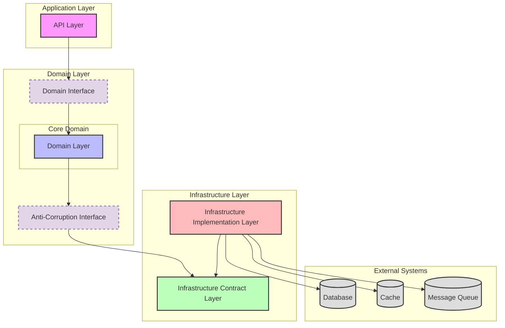

# OpenCoze

OpenCoze is an open-source monorepo project that implements Coze functionality. This repository contains both frontend and backend components, organized in a clean and maintainable architecture.

## Architecture Overview



The architecture diagram above illustrates the clean architecture pattern implemented in OpenCoze. Key points:

1. **Dependency Direction**: Domain and API layers only depend on the Infrastructure Contract Layer, never on concrete implementations.
2. **Infrastructure Contract Layer**: Acts as a bridge between business logic and infrastructure implementations through well-defined interfaces.
3. **Clean Separation**: Domain and API layers remain unaware of specific infrastructure implementations, promoting loose coupling.
4. **Flexibility**: Infrastructure implementations can be easily swapped without affecting business logic.

## Repository Structure

```
├── frontend/               # Frontend application
│   ├── src/                # Source code
│   ├── public/             # Public assets
│   └── tests/              # Frontend tests
│
├── backend/                # Backend services
│   ├── idl/                # Interface Definition Language files
│   │   ├── agent/          # Agent service definitions
│   │   ├── user/           # User service definitions
│   │   └── workflow/       # Workflow service definitions
│   │
│   ├── api/                # API handlers and routing
│   │   ├── agent/          # Agent service endpoints
│   │   ├── user/           # User service endpoints
│   │   └── workflow/       # Workflow service endpoints
│   │
│   ├── domain/             # Domain logic layer
│   │   ├── agent/          # Agent domain logic
│   │   │   ├── entity/     # Agent entities
│   │   │   ├── repository/ # Agent repositories
│   │   │   └── service/    # Agent services
│   │   ├── user/           # User domain logic
│   │   │   ├── entity/     # User entities
│   │   │   ├── repository/ # User repositories
│   │   │   └── service/    # User services
│   │   └── workflow/       # Workflow domain logic
│   │       ├── entity/     # Workflow entities
│   │       ├── repository/ # Workflow repositories
│   │       └── service/    # Workflow services
│   │
│   ├── pkg/                # 无外部依赖的工具方法
│   ├── infra-contract/     # Infrastructure abstraction layer
│   │   ├── cache/          # Cache interfaces
│   │   ├── config/         # Configuration interfaces
│   │   ├── database/       # Database interfaces
│   │   ├── messaging/      # Message queue interfaces
│   │   └── model/          # External model interfaces
│   │
│   └── infra/             # Pluggable infra implementation layer
│       ├── cache/          # Cache implementations (Redis, etc.)
│       ├── config/         # Configuration implementations
│       ├── database/       # Database implementations (MySQL, etc.)
│       ├── messaging/      # Message queue implementations
│       └── model/          # External model implementations
```

## Layer Responsibilities

### Frontend
The frontend application is built using modern frontend technologies and follows best practices for web development.

### Backend

1. **IDL Layer (`/backend/idl`)**
   - Contains interface definitions
   - Defines API contracts and data structures

2. **API Layer (`/backend/api`)**
   - Implements HTTP endpoints using Hertz server
   - Handles request/response processing
   - Contains middleware components

3. **Domain Layer (`/backend/domain`)**
   - Contains core business logic
   - Defines domain entities and value objects
   - Implements business rules and workflows

4. **Infrastructure Contract Layer (`/backend/infra-contract`)**
   - Defines interfaces for all external dependencies
   - Acts as a boundary between domain logic and infrastructure
   - Includes contracts for:
     * Storage systems
     * Caching mechanisms
     * Message queues
     * Configuration management
     * External models and services

5. **Infrastructure Implementation Layer (`/backend/infra`)**
   - Implements the interfaces defined in infra-contract
   - Provides concrete implementations for:
     * Database operations
     * Caching mechanisms
     * Message queue operations
     * Configuration management
     * External service integrations

## Infrastructure Contract Layer Design

The Infrastructure Contract Layer (`infra-contract`) serves as a crucial abstraction layer that:

1. Decouples the domain logic from external dependencies
2. Defines clear interfaces for all infrastructure components
3. Enables easy testing through mock implementations
4. Facilitates switching between different implementations
5. Manages all external stateful dependencies including:
   - Storage systems (databases)
   - Caching mechanisms
   - Message queues
   - Configuration management
   - External models and services

This architecture ensures that the core business logic remains clean and independent of specific infrastructure choices, while the infrastructure implementations can be easily swapped or upgraded as needed.

## 后端代码的设计过程
1. 明确开发任务所属的领域划分，根据预期的产品功能，制定领域边界，确定领域的接口抽象
2. 明确该领域抽象有哪些外部依赖，并将这些外部依赖定义到自身的实例化接口中，以此为领域内部逻辑的实现提供外部依赖
    a. 外部依赖只能来自于 infra/contract、corssdomain 两个包内的接口定义
    b. 可以直接使用 pkg 包下的工具方法
3. 实现领域逻辑时，一般需要各种各样的数据模型，在 DAO 处按照领域目录定义和管理自身的模型定义
4. 在 application 层，根据领域对象的实例化方法所呈现出的依赖关系和依赖顺序，实例化实体并传递给领域对象
5. application 组合各种领域对象 和 infra 实现，提供 API 服务
    a. application 封装 API 服务时，除了传输实体的转换之外，不应该存在其他逻辑
6. api/handler 是站在网关接口的需求上，对 application 和 domain 进行封装，提供 API 服务。

## 关于单测的几点说明
由于一个领域的逻辑开发，仅有两类依赖依赖： 其他领域 和 Infra 层。并且针对其他领域的依赖，需将对其他领域的依赖在本领域的 crossdomain 目录中，定义自己的防腐层。
单测中要求不能出现真实的 IO 请求，由于这种领域的开发规划，单测也变得简单直接，只需解决这两类依赖的 Mock 即可。
- 针对 其他领域 的 Mock
  - 采用 mockgen 将防腐层接口，生成对应的 mock 实体

```go

//go:generate  mockgen -destination ../../../../internal/mock/domain/agent/singleagent/model_mgr_mock.go --package mock -source model_manager.go
type ModelMgr interface {
    MGetModelByID(ctx context.Context, req *modelmgr.MGetModelRequest) ([]*entity.Model, error)
}

```
- Infra 层: 由于对 Infra 层的依赖，不会通过防腐层抽象进行隔离，可采用轻量化的内存型组件作为单元测试的依赖
  - gorm.DB: SQLite
  - Redis: Miniredis
  
单测中统一使用几种工具：

- 断言工具： github.com/stretchr/testify/assert


## 启动前端脚本

按顺序执行：

```bash 
# 将 obric/bot-studio-monorepo 仓库的 integration/open-source 分支，放置在 frontend 目录下
# 注意：obric/bot-studio-monorepo 非常大，仓库的克隆速度非常慢，需要有点耐心，所幸仅需 clone 一次
# 注意：在 Goland 中一定要先将 frontend 目录 Mark directory as Exclusion， 关闭对该目录的索引构建，否则 Goland 会因构建索引而崩溃
# 在 opencoze 根目录下执行
git submodule update --init --progress

# 完成对 node 和 rush 工具的检测和安装，并对 frontend 目录下的前端代码完成构建
# 在 opencoze 根目录下执行
sh scripts/setup_fe.sh

# 基于上一个指令的构建产物，启动前端进程
# 在 opencoze 根目录下执行
sh scripts/start_fe.sh
```

执行成功后，浏览器访问 `http://localhost:3000` 即可