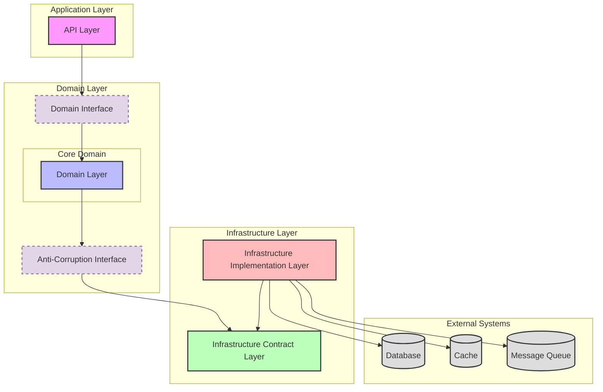

# OpenCoze

OpenCoze is an open-source monorepo project that implements Coze functionality. This repository contains both frontend and backend components, organized in a clean and maintainable architecture.

## Architecture Overview



The architecture diagram above illustrates the clean architecture pattern implemented in OpenCoze. Key points:

1. **Dependency Direction**: Domain and API layers only depend on the Infrastructure Contract Layer, never on concrete implementations.
2. **Infrastructure Contract Layer**: Acts as a bridge between business logic and infrastructure implementations through well-defined interfaces.
3. **Clean Separation**: Domain and API layers remain unaware of specific infrastructure implementations, promoting loose coupling.
4. **Flexibility**: Infrastructure implementations can be easily swapped without affecting business logic.

## Repository Structure

```
├── frontend/               # Frontend application
│   ├── src/                # Source code
│   ├── public/             # Public assets
│   └── tests/              # Frontend tests
│
├── backend/                # Backend services
│   ├── idl/                # Interface Definition Language files
│   │   ├── agent/          # Agent service definitions
│   │   ├── user/           # User service definitions
│   │   └── workflow/       # Workflow service definitions
│   │
│   ├── api/                # API handlers and routing
│   │   ├── agent/          # Agent service endpoints
│   │   ├── user/           # User service endpoints
│   │   └── workflow/       # Workflow service endpoints
│   │
│   ├── domain/             # Domain logic layer
│   │   ├── agent/          # Agent domain logic
│   │   │   ├── entity/     # Agent entities
│   │   │   ├── repository/ # Agent repositories
│   │   │   └── service/    # Agent services
│   │   ├── user/           # User domain logic
│   │   │   ├── entity/     # User entities
│   │   │   ├── repository/ # User repositories
│   │   │   └── service/    # User services
│   │   └── workflow/       # Workflow domain logic
│   │       ├── entity/     # Workflow entities
│   │       ├── repository/ # Workflow repositories
│   │       └── service/    # Workflow services
│   │
│   ├── infra-contract/     # Infrastructure abstraction layer
│   │   ├── cache/          # Cache interfaces
│   │   ├── config/         # Configuration interfaces
│   │   ├── database/       # Database interfaces
│   │   ├── messaging/      # Message queue interfaces
│   │   └── model/          # External model interfaces
│   │
│   └── infra/             # Pluggable infra implementation layer
│       ├── cache/          # Cache implementations (Redis, etc.)
│       ├── config/         # Configuration implementations
│       ├── database/       # Database implementations (MySQL, etc.)
│       ├── messaging/      # Message queue implementations
│       └── model/          # External model implementations
```

## Layer Responsibilities

### Frontend
The frontend application is built using modern frontend technologies and follows best practices for web development.

### Backend

1. **IDL Layer (`/backend/idl`)**
   - Contains interface definitions
   - Defines API contracts and data structures

2. **API Layer (`/backend/api`)**
   - Implements HTTP endpoints using Hertz server
   - Handles request/response processing
   - Contains middleware components

3. **Domain Layer (`/backend/domain`)**
   - Contains core business logic
   - Defines domain entities and value objects
   - Implements business rules and workflows

4. **Infrastructure Contract Layer (`/backend/infra-contract`)**
   - Defines interfaces for all external dependencies
   - Acts as a boundary between domain logic and infrastructure
   - Includes contracts for:
     * Storage systems
     * Caching mechanisms
     * Message queues
     * Configuration management
     * External models and services

5. **Infrastructure Implementation Layer (`/backend/infra`)**
   - Implements the interfaces defined in infra-contract
   - Provides concrete implementations for:
     * Database operations
     * Caching mechanisms
     * Message queue operations
     * Configuration management
     * External service integrations

## Infrastructure Contract Layer Design

The Infrastructure Contract Layer (`infra-contract`) serves as a crucial abstraction layer that:

1. Decouples the domain logic from external dependencies
2. Defines clear interfaces for all infrastructure components
3. Enables easy testing through mock implementations
4. Facilitates switching between different implementations
5. Manages all external stateful dependencies including:
   - Storage systems (databases)
   - Caching mechanisms
   - Message queues
   - Configuration management
   - External models and services

This architecture ensures that the core business logic remains clean and independent of specific infrastructure choices, while the infrastructure implementations can be easily swapped or upgraded as needed.