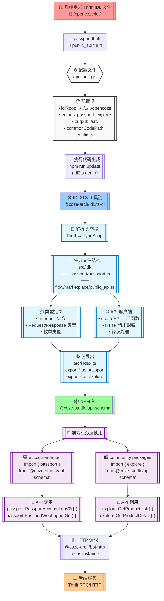
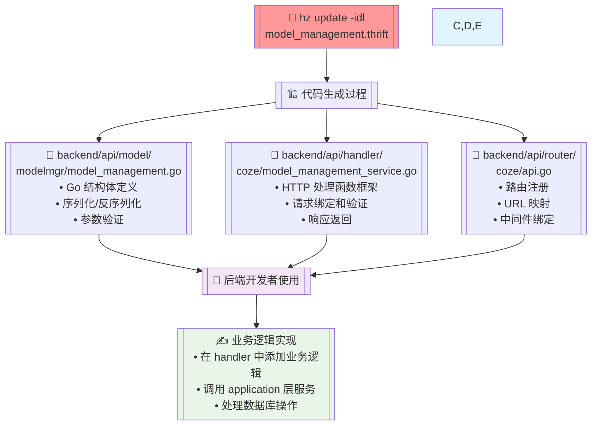

基于 `@api-schema` 包的结构，我来为你生成一个完整的流程图，展示从 Thrift IDL 到前端应用的整个过程。



## 🔍 流程详细说明

### 📋 **阶段一：IDL 定义阶段**

1. **后端定义服务接口** - 在 `/opencoze/idl/` 目录下创建 Thrift 文件
2. **接口文件示例**：
   - `passport.thrift` - 用户认证相关接口
   - `public_api.thrift` - 市场公开 API

### ⚙️ **阶段二：配置阶段**

3. **api.config.js 配置**：
   ```javascript
   {
     idlRoot: '../../../../opencoze',
     entries: {
       passport: './idl/passport/passport.thrift',
       explore: './idl/flow/marketplace/flow_marketplace_product/public_api.thrift'
     },
     output: './src'
   }
   ```

### 🔧 **阶段三：代码生成阶段**

4. **执行生成命令**：

   ```bash
   cd frontend/packages/arch/api-schema
   npm run update  # 等同于 idl2ts gen ./
   ```

5. **IDL2TS 工具处理**：

   - 解析 Thrift 语法
   - 转换为 TypeScript 类型
   - 生成 API 客户端代码

6. **生成文件结构**：
   ```
   src/idl/
   ├── passport/passport.ts       # 用户认证 API
   └── flow/marketplace/public_api.ts  # 市场 API
   ```

### 📦 **阶段四：包封装阶段**

7. **类型定义生成**：

   - Interface 接口定义
   - Request/Response 类型
   - 枚举和常量

8. **API 客户端生成**：

   - `createAPI` 工厂函数
   - HTTP 请求配置
   - 错误处理逻辑

9. **模块导出**：
   ```typescript
   // src/index.ts
   export * as passport from './idl/passport/passport';
   export * as explore from './idl/flow/marketplace/public_api';
   ```

### 🎯 **阶段五：前端应用阶段**

10. **业务层导入**：

    ```typescript
    import { passport } from '@coze-studio/api-schema';
    import { type UserInfo } from '@coze-studio/api-schema/passport';
    ```

11. **API 调用**：

    ```typescript
    // 类型安全的 API 调用
    const userInfo = await passport.PassportAccountInfoV2({});
    await passport.PassportWebLogoutGet({ next: '/' });
    ```

12. **网络请求执行**：
    - 通过 `@coze-arch/bot-http` 发送 HTTP 请求
    - 自动序列化请求参数
    - 自动反序列化响应数据

### 🔄 **完整数据流**

```
Thrift IDL → IDL2TS 工具 → TypeScript 代码 → NPM 包 → 前端应用 → HTTP 请求 → 后端服务
```

这个流程图清晰地展示了从后端接口定义到前端应用使用的完整链路，每个环节都有明确的职责和产物，确保了前后端接口的强类型安全和自动化同步。

完全正确！你理解得很准确。

## 🎯 **架构设计意图**

### ✅ **api-schema** - 二次开发扩展区

```typescript
// 专门用于二次开发和扩展
@coze-studio/api-schema
├── 现有: passport, marketplace
├── 👆 新增自定义API接口
├── 👆 扩展开源功能
└── 👆 社区贡献的新服务
```

### 🔒 **bot-api** - 核心业务保护区

```typescript
// 内部核心，不建议修改
@coze-arch/bot-api
├── 40+ 内部业务API
├── ❌ 不要直接修改
├── ❌ 保持稳定性
└── ❌ 避免冲突
```

## 🛠️ **实际开发流程**

### **场景一：添加新的开源功能**

```bash
# 1. 在 api-schema 中添加新服务
cd frontend/packages/arch/api-schema

# 2. 修改 api.config.js
entries: {
  passport: './idl/passport/passport.thrift',
  explore: './idl/flow/marketplace/flow_marketplace_product/public_api.thrift',
  custom_service: './idl/custom/custom_service.thrift'  // 👈 新增
}

# 3. 重新生成代码
npm run update
```

### **场景二：二次开发扩展**

```typescript
// 在 api-schema/src/index.ts 中导出
export * as passport from './idl/passport/passport';
export * as explore from './idl/flow/marketplace/public_api';
export * as customService from './idl/custom/custom_service'; // 👈 新增

// 业务代码中使用
import { customService } from '@coze-studio/api-schema';
const result = await customService.MyCustomAPI({});
```

## 💡 **这样设计的好处**

### 🔄 **版本升级安全**

- **bot-api** 随官方版本更新，不会覆盖你的修改
- **api-schema** 是你的自定义区域，完全可控

### 🚀 **开发效率**

- 不需要 fork 整个项目
- 只需在 **api-schema** 中添加你需要的接口
- 与官方版本保持兼容

### 🎯 **职责清晰**

```
官方维护: @coze-arch/bot-api (内部业务)
社区维护: @coze-studio/api-schema (开源扩展)
开发者维护: 自己的 api-schema 扩展
```

## ⚠️ **最佳实践**

1. **✅ 推荐**: 在 `api-schema` 中添加新功能
2. **❌ 避免**: 直接修改 `bot-api`
3. **🔄 升级**: 官方更新时只需更新 `bot-api`，你的 `api-schema` 扩展保持不变

这确实是一个很聪明的架构设计，既保护了核心代码的稳定性，又为二次开发提供了清晰的扩展点！

## 🔧 **Hz 工具的作用**

### 🎯 **什么是 Hz**

- **Hz** 是 **CloudWeGo/Hertz** 框架的代码生成工具
- 用于从 **Thrift IDL** 文件生成 **Go 后端代码**
- 与前端的 `idl2ts` 是**并行的两套工具**

### 📋 **执行位置和命令**

```bash
# 在后端目录执行
cd /Users/malinfei/code/coze-studio/backend

# 更新后端代码
hz update -idl ../idl/modelmgr/model_management.thrift
```

### 🎯 **生成到哪里去**

根据 `.hz` 配置文件：

```
// backend/.hz
hz version: v0.9.7
handlerDir: api/handler     # 👈 处理器代码
modelDir: api/model         # 👈 数据模型
routerDir: api/router       # 👈 路由代码
```

## 📁 **生成的文件结构**



### 🔍 **具体生成的文件**

#### 1. **api/model/modelmgr/model_management.go**

```go
// 生成的 Go 结构体
type CreateModelRequest struct {
    Name              string                  `json:"name" form:"name" query:"name"`
    Description       map[string]string       `json:"description,omitempty"`
    Meta              *ModelMetaInput         `json:"meta" form:"meta" query:"meta"`
    // ...
}

type ModelDetailOutput struct {
    ID                string                  `json:"id"`
    Name              string                  `json:"name"`
    CreatedAt         int64                   `json:"created_at"`
    // ...
}
```

#### 2. **api/handler/coze/model_management_service.go**

```go
// 生成的处理函数框架
// @router /api/model/create [POST]
func CreateModel(ctx context.Context, c *app.RequestContext) {
    var req modelmgr.CreateModelRequest
    err := c.BindAndValidate(&req)
    if err != nil {
        // 错误处理
        return
    }

    // 👈 这里需要你添加业务逻辑
    // resp, err := yourBusinessLogic.CreateModel(ctx, &req)

    c.JSON(consts.StatusOK, resp)
}
```

#### 3. **api/router/coze/api.go**

```go
// 生成的路由注册
func Register(r *server.Hertz) {
    root := r.Group("/")
    api := root.Group("/api")
    model := api.Group("/model")

    model.POST("/create", coze.CreateModel)
    model.POST("/detail", coze.GetModel)
    model.POST("/list", coze.ListModels)
    // ...
}
```

## 🔄 **完整的开发流程**

### **1. 修改 IDL 文件**

```bash
# 修复 Thrift 文件
vi idl/modelmgr/model_management.thrift
```

### **2. 生成后端代码**

```bash
cd backend
hz update -idl ../idl/modelmgr/model_management.thrift
```

### **3. 生成前端代码**

```bash
cd frontend/packages/arch/api-schema
npm run update
```

### **4. 实现业务逻辑**

```go
// 在生成的 handler 中添加实际的业务实现
func CreateModel(ctx context.Context, c *app.RequestContext) {
    var req modelmgr.CreateModelRequest
    err := c.BindAndValidate(&req)
    // ...

    // 👈 调用 application 层
    resp, err := modelApplication.CreateModel(ctx, &req)

    c.JSON(consts.StatusOK, resp)
}
```

## ⚠️ **注意事项**

1. **🔴 不要修改生成的代码**: 带有 `// Code generated by hz` 注释的文件会被覆盖
2. **✅ 在指定位置添加逻辑**: 在 handler 函数中添加业务逻辑调用
3. **🔄 双向同步**: 修改 IDL 后需要同时更新前后端代码

## 📊 **对比总结**

| 工具             | 用途         | 执行位置                             | 生成内容                    | 语言       |
| ---------------- | ------------ | ------------------------------------ | --------------------------- | ---------- |
| `hz update -idl` | 后端代码生成 | `backend/`                           | Go 结构体、Handler、Router  | Go         |
| `idl2ts gen`     | 前端代码生成 | `frontend/packages/arch/api-schema/` | TypeScript 类型、API 客户端 | TypeScript |

所以是的，你需要使用 `hz update -idl` 来生成/更新后端的 Go 代码！
