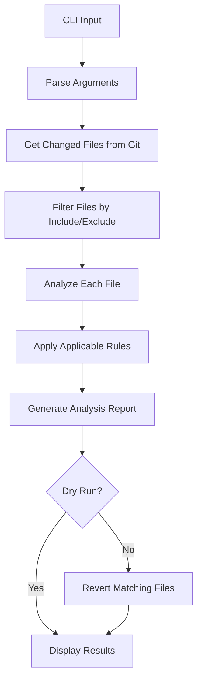

# Revert Useless Changes

A functional programming-based tool to automatically detect and revert files with only cosmetic changes (whitespace or comments) in Git repositories.

## Architecture Overview

### 🏗️ Core Design Principles

- **Functional Programming**: Pure functions with minimal side effects
- **Rule-Based Analysis**: Extensible rule system for different change types
- **Immutable Data Flow**: Data flows through pure transformation functions
- **Type Safety**: Full TypeScript coverage with strict typing

### 📦 Module Structure

```
src/revert-useless-changes/
├── types.ts              # Core type definitions
├── config.ts             # Constants and configuration
├── utils/                # Pure utility functions
│   ├── git.ts            # Git operations (getChangedFiles, revertFile, etc.)
│   └── file.ts           # File system operations (exists, readFile, etc.)
├── rules/                # Analysis rules
│   ├── index.ts          # Rule registry and matching
│   ├── whitespace-rule.ts # Detects whitespace-only changes
│   └── ast-comment-rule.ts # Detects comment-only changes via AST
├── reporter.ts           # Output formatting (console, JSON)
├── orchestrator.ts       # Main workflow coordination
├── cli.ts               # Command-line interface (Commander.js)
└── index.ts             # Public API exports
```

## 🔄 Core Workflow



## 🧩 Key Modules

### 1. **Orchestrator** (`orchestrator.ts`)
**Purpose**: Coordinates the entire analysis workflow

**Core Function**: `execute(config: Config) -> Promise<AnalysisReport>`

**Flow**:
```typescript
1. getChangedFiles() -> string[]        // Get Git changed files
2. filterFiles() -> string[]           // Apply include/exclude patterns
3. analyzeFiles() -> FileAnalysis[]    // Analyze each file with rules
4. generateReport() -> AnalysisReport  // Create summary statistics
5. performReverts() -> AnalysisReport  // Revert files (if not dry run)
```

### 2. **Rule System** (`rules/`)
**Purpose**: Pluggable analysis rules for different change types

**Rule Interface**:
```typescript
interface Rule {
  name: string;                    // Unique identifier
  description: string;             // Human-readable description
  filePatterns: readonly string[]; // Glob patterns for applicable files
}

type RuleAnalyzer = (filePath: string, config: Config) => Promise<RuleResult>
```

**Built-in Rules**:
- **WhitespaceRule**: Uses `git diff -w` to detect whitespace-only changes
- **AstCommentRule**: Parses JS/TS with AST, removes comments, compares structure

**Rule Registry**:
```typescript
getRulesForFile(filePath) -> RuleDefinition[]  // Get applicable rules
getAllRules() -> RuleDefinition[]              // Get all available rules
```

### 3. **Git Utilities** (`utils/git.ts`)
**Purpose**: Pure functions for Git operations

**Key Functions**:
```typescript
getChangedFiles(options) -> string[]           // List modified files
hasOnlyWhitespaceChanges(file, options) -> boolean
getFileContentAtRef(file, options) -> string  // Get file at Git ref
revertFile(file, options) -> void             // Revert single file
findGitRepositoryRoot(startDir) -> string | null  // Find Git repo root
validateGitRepository(cwd) -> void             // Validate Git repo or throw
```

### 4. **File Utilities** (`utils/file.ts`)
**Purpose**: Pure functions for file system operations

**Key Functions**:
```typescript
exists(path) -> boolean                    // Check file existence
readFile(path) -> string                   // Read file content
matchesPattern(path, patterns) -> boolean  // Pattern matching
toAbsolutePath(path, base) -> string       // Path resolution
```

### 5. **Reporter** (`reporter.ts`)
**Purpose**: Output formatting and user feedback

**Key Functions**:
```typescript
generateReport(report, config) -> void     // Main report output
logProgress(message, config) -> void       // Progress updates
logVerbose(message, config) -> void        // Detailed logging
logError/logWarning/logSuccess(...)        // Status messages
```

## 🔍 Analysis Process

### File Analysis Flow
```typescript
1. Check file existence
2. Find applicable rules based on file patterns
3. Execute each rule analyzer function
4. Combine results: shouldRevert = any(rule.shouldRevert)
5. Create FileAnalysis with results and matched rule
```

### Rule Execution
```typescript
// Whitespace Rule
hasOnlyWhitespaceChanges(file) -> RuleResult {
  shouldRevert: git diff -w shows no changes
}

// AST Comment Rule
analyzeAstCommentRule(file) -> RuleResult {
  1. Parse current and previous versions with TypeScript parser
  2. Remove comment nodes from both ASTs
  3. Deep compare cleaned ASTs
  4. shouldRevert: ASTs are structurally identical
}
```

## 📊 Data Flow

### Configuration Flow
```
CLI Arguments -> Config Object -> All Functions
```

### Analysis Flow
```
Git Files -> File Filters -> Rule Analysis -> Report Generation -> Output
```

### Types Flow
```typescript
Config -> FileAnalysis[] -> AnalysisReport -> Console/JSON Output
```

## 🎯 Extension Points

### Adding New Rules
```typescript
// 1. Define rule constant
export const NEW_RULE: Rule = {
  name: 'new-rule',
  description: 'Detects new type of changes',
  filePatterns: ['**/*.ext']
};

// 2. Implement analyzer function
export const analyzeNewRule = async (filePath: string, config: Config): Promise<RuleResult> => {
  // Analysis logic here
  return { filePath, ruleName: NEW_RULE.name, shouldRevert: true/false };
};

// 3. Register in rules/index.ts
export const AVAILABLE_RULES = [
  { rule: WHITESPACE_RULE, analyzer: analyzeWhitespaceRule },
  { rule: AST_COMMENT_RULE, analyzer: analyzeAstCommentRule },
  { rule: NEW_RULE, analyzer: analyzeNewRule }
];
```

### Adding New Output Formats
```typescript
// Extend reporter.ts
export const generateXmlReport = (report: AnalysisReport) => {
  // XML formatting logic
};
```

## 🧪 Testing Strategy

### Unit Testing
- Test each pure function in isolation
- Mock Git operations for deterministic tests
- Test rule analyzers with sample files

### Integration Testing
- Test full workflow with temporary Git repos
- Test CLI argument parsing
- Test error handling scenarios

## 🚀 Usage

### Programmatic API
```typescript
import { analyzeAndRevert } from './index';

const report = await analyzeAndRevert({
  cwd: '/path/to/project',
  dryRun: true,
  verbose: false
});
```

### CLI Usage
```bash
# Analyze and show what would be reverted
revert-useless-changes --dry-run --verbose

# Actually revert files with only whitespace/comment changes
revert-useless-changes

# Analyze specific file types only
revert-useless-changes --include "**/*.ts" --include "**/*.js"
```

## 💡 Key Benefits

1. **Safe Operations**: Dry-run mode prevents accidental changes
2. **Intelligent Analysis**: AST-based comment detection, Git-based whitespace detection
3. **Extensible**: Easy to add new rule types
4. **Fast**: Functional approach enables efficient processing
5. **Reliable**: Pure functions are predictable and testable