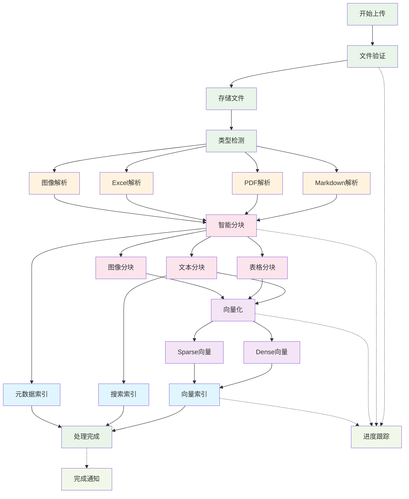
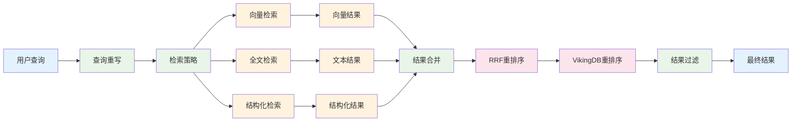
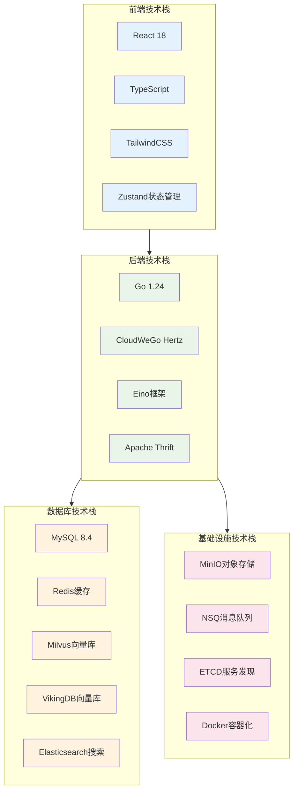
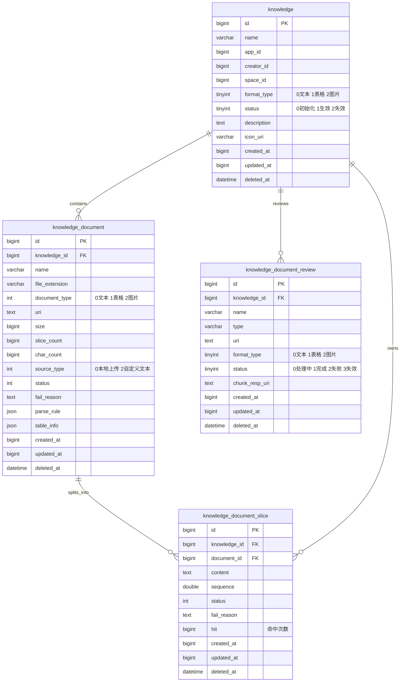

# Coze Studio 知识库系统架构文档

## 概述

Coze Studio 知识库系统是一个企业级的 RAG（Retrieval-Augmented Generation）平台，支持多格式文档处理、混合检索和智能问答。系统采用分层架构设计，具备高性能、高可用和可扩展的特性。

## 核心功能

- 📥 **文档管理**：支持多格式文档上传、解析和处理
- 🧠 **智能处理**：文档分块、向量化和多重索引
- 🔍 **混合检索**：语义搜索、全文搜索和结构化查询
- ⚡ **性能优化**：分布式存储、缓存机制和异步处理
- 🔐 **企业特性**：多租户、权限控制和审计日志

## 系统架构

### 整体架构分层

```mermaid
graph TB
    subgraph Frontend["前端模块层"]
        KnowledgeIDE["知识库IDE"]
        KnowledgeModal["知识库弹窗"]
        ResourceProcessor["资源处理器"]
        FileUploader["文件上传组件"]
        SearchBox["搜索框组件"]
        ResultDisplay["结果展示组件"]
    end

    subgraph APILayer["API接口层"]
        KnowledgeHandler["知识库处理器"]
        DocumentHandler["文档处理器"]
        RetrievalHandler["检索处理器"]
        ThriftIDL["Thrift接口定义"]
        APIModels["API数据模型"]
    end

    subgraph ApplicationLayer["应用服务层"]
        KnowledgeAppService["知识库应用服务"]
        UploadService["上传服务"]
        AuthService["认证服务"]
    end

    subgraph DomainLayer["领域业务层"]
        KnowledgeService["知识库服务"]
        DocumentService["文档服务"]
        DocumentProcessor["文档处理器"]
        RetrievalEngine["检索引擎"]
        ChunkingEngine["分块引擎"]
        ParsingEngine["解析引擎"]
    end

    subgraph InfrastructureLayer["基础设施层"]
        MilvusImpl["Milvus实现"]
        VikingDBImpl["VikingDB实现"]
        ElasticsearchImpl["Elasticsearch实现"]
        OpenAIEmbedding["OpenAI嵌入"]
        ArkEmbedding["Ark嵌入"]
        MarkdownParser["Markdown解析器"]
        PDFParser["PDF解析器"]
        ExcelParser["Excel解析器"]
        ImageParser["图像解析器"]
        VikingDBRerank["VikingDB重排序"]
        RRFRerank["RRF重排序"]
    end

    subgraph DataLayer["数据存储层"]
        MySQL["MySQL数据库"]
        Redis["Redis缓存"]
        Milvus["Milvus向量库"]
        VikingDB["VikingDB向量库"]
        Elasticsearch["Elasticsearch搜索"]
        MinIO["MinIO对象存储"]
        NSQ["NSQ消息队列"]
    end

    %% 依赖关系
    KnowledgeIDE --> KnowledgeHandler
    FileUploader --> DocumentHandler
    SearchBox --> RetrievalHandler

    KnowledgeHandler --> KnowledgeAppService
    DocumentHandler --> KnowledgeAppService
    RetrievalHandler --> KnowledgeAppService

    KnowledgeAppService --> KnowledgeService
    KnowledgeAppService --> DocumentService

    KnowledgeService --> DocumentProcessor
    KnowledgeService --> RetrievalEngine
    DocumentService --> ChunkingEngine
    DocumentService --> ParsingEngine

    DocumentProcessor --> MarkdownParser
    DocumentProcessor --> PDFParser
    DocumentProcessor --> ExcelParser
    DocumentProcessor --> ImageParser

    RetrievalEngine --> MilvusImpl
    RetrievalEngine --> VikingDBImpl
    RetrievalEngine --> ElasticsearchImpl
    RetrievalEngine --> OpenAIEmbedding
    RetrievalEngine --> ArkEmbedding
    RetrievalEngine --> VikingDBRerank
    RetrievalEngine --> RRFRerank

    MilvusImpl --> Milvus
    VikingDBImpl --> VikingDB
    ElasticsearchImpl --> Elasticsearch
    KnowledgeService --> MySQL
    RetrievalEngine --> Redis
    DocumentProcessor --> MinIO
    DocumentProcessor --> NSQ

    %% 样式
    classDef frontend fill:#e3f2fd
    classDef api fill:#f3e5f5
    classDef application fill:#e8f5e8
    classDef domain fill:#fff3e0
    classDef infra fill:#fce4ec
    classDef data fill:#f1f8e9

    class KnowledgeIDE,KnowledgeModal,ResourceProcessor,FileUploader,SearchBox,ResultDisplay frontend
    class KnowledgeHandler,DocumentHandler,RetrievalHandler,ThriftIDL,APIModels api
    class KnowledgeAppService,UploadService,AuthService application
    class KnowledgeService,DocumentService,DocumentProcessor,RetrievalEngine,ChunkingEngine,ParsingEngine domain
    class MilvusImpl,VikingDBImpl,ElasticsearchImpl,OpenAIEmbedding,ArkEmbedding,MarkdownParser,PDFParser,ExcelParser,ImageParser,VikingDBRerank,RRFRerank infra
    class MySQL,Redis,Milvus,VikingDB,Elasticsearch,MinIO,NSQ data
```



### 架构层级说明

| 层级 | 作用 | 主要组件 |
|------|------|----------|
| **前端层** | 用户界面和交互 | React组件、状态管理、UI库 |
| **API层** | 接口服务和路由 | HTTP handlers、Thrift IDL、数据模型 |
| **应用层** | 业务编排和服务 | 应用服务、认证服务、上传服务 |
| **领域层** | 核心业务逻辑 | 知识库服务、文档处理、检索引擎 |
| **基础设施层** | 技术实现和适配 | 数据库实现、解析器、嵌入模型 |
| **数据层** | 数据存储和管理 | 多种数据库、缓存、消息队列 |

## 核心流程

### 文档上传处理流程



#### 上传流程说明

1. **文件验证阶段**
   - 文件格式验证（支持 MD、PDF、XLSX、CSV、TXT、图片等）
   - 文件大小限制检查
   - 用户权限验证

2. **文档解析阶段**
   - 根据文件类型选择对应解析器
   - 提取文档内容和元数据
   - 处理特殊格式（表格、图片OCR等）

3. **智能分块阶段**
   - 根据文档类型选择分块策略
   - 语义边界检测
   - 重叠配置防止信息丢失

4. **向量化阶段**
   - Dense向量：语义理解
   - Sparse向量：关键词匹配
   - 批量处理提高效率

5. **索引构建阶段**
   - 向量数据库索引（Milvus/VikingDB）
   - 全文搜索索引（Elasticsearch）
   - 元数据存储（MySQL）

### 文档检索查询流程



#### 检索流程说明

1. **查询预处理**
   - 查询意图分析
   - 查询重写和优化
   - 上下文信息整合

2. **多路并行检索**
   - **向量检索**：基于语义相似度的Dense/Sparse向量搜索
   - **全文检索**：基于关键词的传统文本搜索
   - **结构化检索**：针对表格数据的NL2SQL查询

3. **结果处理**
   - 多源结果合并
   - 分数归一化处理
   - 去重和相关性过滤

4. **智能重排序**
   - **RRF重排序**：倒数排名融合算法
   - **VikingDB重排序**：基于神经网络的语义重排序
   - 上下文相关性优化

5. **最终过滤**
   - 权限过滤
   - 相关性阈值过滤
   - 结果多样性保证

## 技术栈

### 核心技术选型



### 技术栈详细说明

| 类别 | 技术 | 版本 | 用途 |
|------|------|------|------|
| **前端框架** | React | 18.2.0 | 用户界面开发 |
| **类型系统** | TypeScript | 5.8.2 | 静态类型检查 |
| **构建工具** | Rsbuild | 1.1.0 | 基于Rspack的构建工具 |
| **状态管理** | Zustand | - | 轻量级状态管理 |
| **UI样式** | TailwindCSS | 3.3.3 | 原子化CSS框架 |
| **后端语言** | Go | 1.24.0 | 高性能后端服务 |
| **Web框架** | CloudWeGo Hertz | - | 高性能HTTP框架 |
| **AI框架** | Eino | - | LLM工作流框架 |
| **接口定义** | Apache Thrift | - | RPC接口定义 |
| **关系数据库** | MySQL | 8.4.5 | 元数据存储 |
| **缓存数据库** | Redis | 8.0 | 高速缓存 |
| **向量数据库** | Milvus | 2.5.10 | 开源向量数据库 |
| **向量数据库** | VikingDB | - | 字节自研向量数据库 |
| **搜索引擎** | Elasticsearch | 8.18.0 | 全文搜索引擎 |
| **对象存储** | MinIO | - | S3兼容对象存储 |
| **消息队列** | NSQ | - | 分布式消息队列 |
| **服务发现** | ETCD | 3.5 | 分布式协调服务 |

## 数据模型

### 核心数据表结构



### 数据表说明

- **knowledge**: 知识库基础信息表，存储知识库元数据
- **knowledge_document**: 文档信息表，存储上传文档的基本信息和处理状态
- **knowledge_document_slice**: 文档切片表，存储文档分块后的内容片段
- **knowledge_document_review**: 文档审核表，用于文档处理前的预览和审核

## 核心特性

### 文档处理能力

- **多格式支持**: Markdown、PDF、Word、Excel、CSV、TXT、图片
- **智能解析**: 基于文件类型的专用解析器
- **OCR能力**: 图片文字识别和字幕生成
- **表格处理**: 结构化数据提取和NL2SQL支持
- **分块策略**: 语义分块、重叠配置、自定义分隔符

### 检索能力

- **混合检索**: Dense向量 + Sparse向量 + 全文搜索
- **多向量数据库**: Milvus、VikingDB双引擎支持
- **智能重排序**: RRF算法 + 神经网络重排序
- **查询优化**: 查询重写、意图理解、上下文整合
- **缓存机制**: 多层缓存优化查询性能

### 性能特性

- **异步处理**: 文档处理异步化，支持大批量处理
- **分布式存储**: 多数据库分片和副本支持
- **缓存优化**: Redis多层缓存，热点数据快速访问
- **批量优化**: 向量化和索引构建的批量处理
- **资源限制**: 智能的资源使用控制和限流

### 企业特性

- **多租户**: 基于空间和应用的多租户架构
- **权限控制**: 细粒度的访问权限管理
- **审计日志**: 完整的操作审计和追踪
- **监控告警**: 系统性能和业务指标监控
- **高可用**: 服务集群化和故障恢复

## 部署架构

### Docker Compose 开发环境

系统使用 Docker Compose 提供完整的开发环境，包含以下服务：

- **MySQL 8.4.5**: 主数据库
- **Redis 8.0**: 缓存服务
- **Elasticsearch 8.18.0**: 搜索引擎（含smartcn中文分词）
- **Milvus 2.5.10**: 向量数据库
- **MinIO**: 对象存储服务
- **ETCD 3.5**: 服务发现
- **NSQ**: 消息队列服务

### Kubernetes 生产环境

生产环境支持 Kubernetes 部署，提供 Helm Charts：

- 服务自动伸缩
- 负载均衡和服务发现
- 存储持久化
- 配置管理
- 监控和日志收集

## 开发指南

### 本地开发环境搭建

```bash
# 启动基础设施服务
make middleware

# 启动后端服务
make server

# 构建前端
make fe

# 完整环境启动
make web
```

### 关键配置文件

- `docker-compose.yml`: Docker服务编排
- `backend/conf/`: 后端配置文件目录
- `rush.json`: 前端monorepo配置
- `Makefile`: 构建和部署脚本

### 测试

- **后端测试**: Go原生测试框架
- **前端测试**: Vitest测试框架
- **集成测试**: Docker环境集成测试

## 扩展开发

### 添加新的文档格式支持

1. 在 `backend/infra/impl/document/parser/builtin/` 添加新解析器
2. 实现 `DocumentParser` 接口
3. 在文档处理器中注册新格式
4. 添加对应的前端上传支持

### 添加新的向量数据库支持

1. 在 `backend/infra/impl/document/searchstore/` 创建新实现
2. 实现 `SearchStore` 接口
3. 添加配置支持和连接管理
4. 更新服务注册和依赖注入

### 自定义重排序算法

1. 在 `backend/infra/impl/document/rerank/` 添加实现
2. 实现 `Reranker` 接口
3. 集成到检索引擎中
4. 添加配置参数支持

## 监控和运维

### 关键指标

- **性能指标**: 文档处理吞吐量、检索响应时间、向量化耗时
- **业务指标**: 知识库数量、文档数量、查询QPS、命中率
- **系统指标**: CPU/内存使用率、数据库连接数、缓存命中率
- **错误指标**: 处理失败率、检索错误率、系统异常数

### 日志管理

- **结构化日志**: JSON格式，便于解析和检索
- **分级日志**: DEBUG、INFO、WARN、ERROR四个级别
- **链路追踪**: 分布式请求链路跟踪
- **业务日志**: 用户操作和业务事件记录

### 故障处理

- **重试机制**: 文档处理失败自动重试
- **熔断保护**: 外部服务调用熔断
- **降级策略**: 检索服务降级方案
- **备份恢复**: 数据备份和恢复策略

## 相关文档

- [API接口文档](./api.md)
- [配置参数说明](./config.md)
- [部署运维指南](./deployment.md)
- [开发规范](./development.md)
- [故障排查手册](./troubleshooting.md)

---

*本文档持续更新中，如有问题或建议，请提交 Issue 或 Pull Request。*