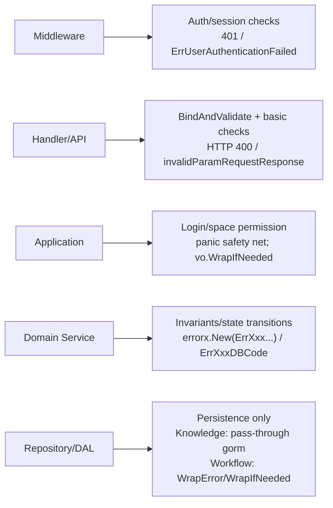

# Skill 6: Error codes (errno) and validation conventions

This document consolidates **error-code definition & registration**, **error infrastructure**, and **layered responsibilities** for validation and error propagation.

---

## 1) Error-code definition and registration

### Where to define

`backend/types/errno/{domain}.go` — one file per domain.

### Ranges and naming

Naming follows `Err{Domain}{Scenario}Code`. Example (Plugin domain):

```go
// Plugin: 109 000 000 ~ 109 999 999
const (
    ErrPluginInvalidParamCode = 109000000
    ErrPluginPermissionCode   = 109000001
    ...
)
```

**Domain ranges**

| Domain | Range | File |
|---|---|---|
| Agent | 100 000 000 ~ 100 999 999 | `backend/types/errno/agent.go` |
| App | 101 000 000 ~ 101 999 999 | `backend/types/errno/app.go` |
| Connector | 102 000 000 ~ 102 999 999 | `backend/types/errno/connector.go` |
| Conversation | 103 000 000 ~ 103 999 999 | `backend/types/errno/conversation.go` |
| Knowledge | 105 000 000 ~ 105 999 999 | `backend/types/errno/knowledge.go` |
| Permission | 108 000 000 ~ 108 999 999 | `backend/types/errno/permission.go` |
| Plugin | 109 000 000 ~ 109 999 999 | `backend/types/errno/plugin.go` |
| User | 700 000 000 ~ 700 999 999 | `backend/types/errno/user.go` |
| Workflow | mixed/special ranges | `backend/types/errno/workflow.go` |

Each domain should have dedicated “invalid param” and “permission denied” codes (e.g., `ErrXxxInvalidParamCode`, `ErrXxxPermissionCode`).

### Registration and usage

- Register in `init()` via `code.Register(errCode, "message template {key}", opts...)` (`{key}` is a placeholder).
- `code.WithAffectStability(false)` means it should not impact stability metrics (expected business errors).
- Create: `errorx.New(errno.ErrXxx, errorx.KV("key", "val"))` or `errorx.KVf("key", format, args...)`.
- Wrap: `errorx.WrapByCode(err, code, options...)` (with a business code) or `errorx.Wrapf(err, format, args...)` (context only).

### Application/Domain: no bare errors — business errors must carry codes

- **Do not** `return errors.New(...)` or `return fmt.Errorf(...)` in the Application/Domain layers for expected business failures. Bare errors are treated as system errors at the Handler boundary and will become **HTTP 500 + "internal server error"**.
- **Must** wrap expected errors (invalid param, permission, not found, DB constraint conflicts, etc.) with `errorx.New(errno.ErrXxx, ...)` or `errorx.WrapByCode(err, errno.ErrXxx, ...)`, so the API responds as HTTP 200 with clear `{code,msg}`.

### Recommendation: preserve context with Wrap

- Prefer `errorx.Wrapf(err, "context: %s", arg)` or `errorx.WrapByCode(err, code, ...)` when passing errors upward.
- If `github.com/pkg/errors` is used, `errors.Wrap/Wrapf` can also preserve stack/cause chains; before returning to HTTP, ensure the error becomes a status error with a proper errno code to avoid falling back to 500.

---

## 2) Error infrastructure

### Core error type: `StatusError`

Unified interface: `Code()`, `Msg()`, `IsAffectStability()`, `Extra()`.

### HTTP error handling behavior

- Business errors (`StatusError`) → **HTTP 200** + `{code: bizCode, msg: bizMsg}`
- System errors (non-`StatusError`) → **HTTP 500** + `{code: 500, msg: "internal server error"}`
- Bind/validate failures → **HTTP 400** via `invalidParamRequestResponse(c, errMsg)`

### `WithAffectStability` convention

| Error type | WithAffectStability | Meaning |
|---|---:|---|
| Invalid param | false | user input issue |
| Permission denied | false | expected access control |
| Not found | false | expected business state |
| DB/Redis/IDgen failures | true | infrastructure incident |

Errors with business codes are logged via warn; bare errors are logged as errors.

---

## 3) Request flow and layer responsibilities (architecture)

```mermaid
graph TD
    "HTTP request" --> "Middleware"
    "Middleware" --> "Handler/API (backend/api/handler)"
    "Handler/API (backend/api/handler)" --> "Application (backend/application)"
    "Application (backend/application)" --> "Domain Service (backend/domain/*/service)"
    "Domain Service (backend/domain/*/service)" --> "Repository/DAL (backend/domain/*/internal/dal)"
    "Domain Service (backend/domain/*/service)" --> "Repository Interface (backend/domain/*/repository)"
```

---

## 4) Validation and error responsibilities by layer

### 4.1 Middleware

**Purpose**: authn/authz prerequisites for all business logic.

- **Session auth**: validate `session_key` cookie; failure → `401 Unauthorized`
- **OpenAPI auth**: validate `Authorization: Bearer <token>`; failure → `ErrUserAuthenticationFailed`

### 4.2 Handler/API

**Purpose**: bind + format validation and simple prechecks (non-zero, enum, length, etc.).

- Unified responses:
  - `invalidParamRequestResponse(c, errMsg)` → HTTP 400
  - `internalServerErrorResponse(ctx, c, err)` → HTTP 200 (biz code) or HTTP 500 (system)
- Patterns:
  - `BindAndValidate` tag validation
  - plus manual checks (enums/ranges/combination constraints)
  - OpenAPI routes also use `invalidParamRequestResponse`

### 4.3 Application

**Purpose**: semantic checks (login state, space permission, business combinations), orchestrate domain services, and convert panics to standard errors.

- Read UID from context; missing UID → permission error
- `checkUserSpace` / cross-user space checks
- Workflow: use `defer` + `vo.WrapIfNeeded` safety net; non-WorkflowError mapped to `ErrWorkflowOperationFail`, etc.

### 4.4 Domain Service

**Purpose**: core business invariants (required fields, consistency, state transitions). This layer is the primary source of business errno codes.

- Required/combined params: `errorx.New(errno.ErrXxxInvalidParamCode, errorx.KV("msg", "..."))`
- DB failures: wrap as `ErrXxxDBCode`; illegal states: `ErrXxxNonRetryableCode` / `ErrXxxNotExistCode`, etc.
- You may keep a private `checkRequest` helper to normalize errors.
- **Workflow domain**: use `vo.WorkflowError` / `vo.NewError` / `vo.WrapError` / `vo.WrapIfNeeded` instead of `errorx.New`.

### 4.5 Repository/DAL

**Purpose**: persistence only; no business validation. Convert storage failures to infra errors or “not found”.

- **Knowledge style**: DAL returns raw gorm errors; Domain wraps them; empty-list reads short-circuit to nil
- **Workflow style**: DAL uses `vo.WrapError` / `vo.WrapIfNeeded`; `gorm.ErrRecordNotFound` → `ErrWorkflowNotFound`; read operations protected by `defer` + WrapIfNeeded

---

## 5) Quick reference: what each layer does



## 6) Validation order & principles

- Validation should be **progressive by layer** (strict-to-semantic), without repeating the exact same checks everywhere.
- Do not overuse `strings.TrimSpace()` just to “detect empty”; spaces may be valid input (e.g., passwords). Incorrect input should fail naturally.
- Avoid defensive `req == nil` checks in most paths; nil requests or nil injected dependencies should be caught during development, not handled repeatedly at runtime.
- Avoid redundant `v == nil { continue }` checks when iterating over `[]*Object` unless it is realistically possible.

---

## 7) OpenAPI error-code mapping

The Workflow domain maintains an internal errno → OpenAPI errno mapping table; external APIs should not expose internal workflow error codes directly.

---

## Notes

1. Two DAL styles are acceptable: Knowledge (pass-through) vs Workflow (wrap inside DAL).
2. `errorx.KV` vs `errorx.KVf`: KV replaces `{key}` with a value; KVf supports formatted values.
3. Workflow errors (`WorkflowError`) provide extra methods like `Level()`, `OpenAPICode()`, `AppendDebug()`, and are workflow-chain specific.
4. No bare errors in Application/Domain for expected business paths — always attach errno.
5. Prefer Wrap to preserve context for troubleshooting.

---

## Citations

See `backend/pkg/errorx/error.go`, `backend/pkg/errorx/code/register.go`, `backend/api/internal/httputil/error_resp.go`, `backend/api/handler/coze/base.go`, and [citations.md](citations.md).

