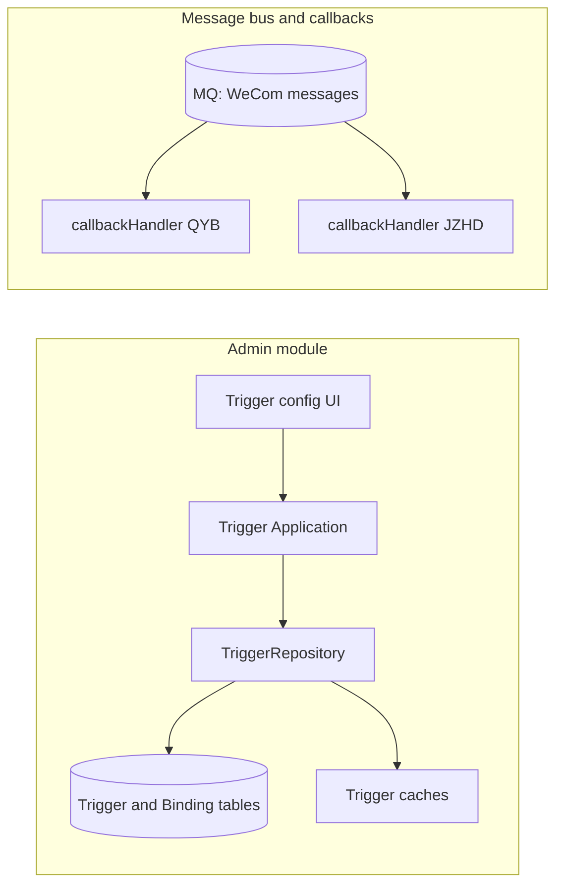
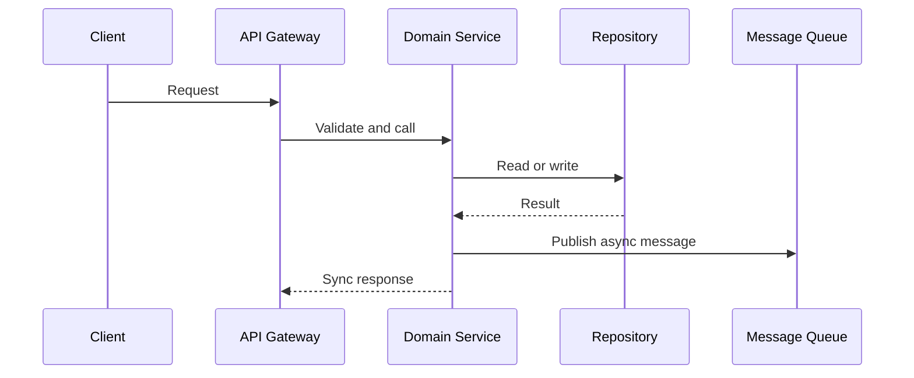

# Flowchart Generator Skill

This skill generates **Mermaid diagrams** compatible with **Mermaid 9.2.2**, focusing on flowcharts, sequence diagrams, and high-level architecture diagrams.

Goals:
- Abstract a clear process/architecture from **requirements** or **existing code structure**.
- Output Mermaid syntax that renders in Markdown/Confluence.
- Keep diagrams **simple, layered, and easy to modify**.

---

## When to use (triggers)

Use this skill when the user asks for:
- “draw a flowchart / sequence diagram / architecture diagram / system design diagram”
- “express this workflow/system in Mermaid”
- “generate Mermaid I can paste into Confluence”
- “derive a call graph/module diagram from code structure”

Keywords: `mermaid`, `flowchart`, `sequenceDiagram`, “system overview”, “architecture diagram”, etc.

---

## Core principles

1. **Abstract first, draw second**
   - Identify actors/modules, key steps, inputs/outputs, then map into Mermaid.
   - If using code as input, focus on boundaries and the “main trunk” call chain; don’t diagram every helper function.

2. **Mermaid 9.2.2 compatibility**
   - Prefer classic syntax: `graph LR` / `graph TD`, `sequenceDiagram`.
   - **Do not use `\n` inside node labels**; keep a single line. If you need more info, shorten the label.
   - One line per edge or node definition; avoid compact multi-target syntax like `A --> B C`.
   - Keep edge labels short (`|Text|`), or omit them if the environment is strict.
   - Avoid very new syntax features; stick to basic shapes.

3. **Semantics > details**
   - Target **10–20 nodes** for a system diagram; if larger, split into multiple diagrams.
   - Name nodes as “role + key responsibility” (e.g., `TriggerRepository`, `WeworkMessageAggregator`).
   - Avoid enumerating all fields/parameters; show the main interactions and directions.

4. **Language handling**
   - Mermaid node IDs should be ASCII-friendly (English or pinyin without spaces); labels can be localized.

---

## Diagram types and templates

### 1) System overview (component/module diagram)

Use to show module boundaries and dependencies.

Guidelines:
- Each `subgraph` is one domain/module.
- Declare nodes first, then connect them with simple arrows.
- Split the diagram if it becomes too large.

### 2) Sequence diagram (`sequenceDiagram`)

Use to show time-ordered interactions.

Guidelines:
- Keep `participant` lines simple.
- Use `alt/else/end` only when branching is essential, and keep branch names short.
- Keep messages short (e.g., “Check cache”, “AppendMessage”, “AsyncExecuteWorkflow”).

---

## Generating diagrams from code

When the user asks to “generate a diagram from code”, follow:

1. Identify domains/boundaries (directories/dependencies) and map them to `subgraph`.
2. Extract key roles:
   - Core structs, key interfaces, and external dependencies (MQ topics, crossdomain services).
3. Build the main call chain (A → B → C → D) and only diagram that trunk.
4. Output style:
   - One short sentence describing the diagram’s purpose.
   - Then a Mermaid code block containing **only** the diagram (no extra narration inside).

---

## Mermaid 9.2.2 compatibility checklist

1. No `\n` in labels:
   - Bad: `Node[Application\nTrigger Application]`
   - Good: `Node[Application Trigger Application]`
2. One edge per line:
   - Bad: `A --> B C`
   - Good:
     - `A --> B`
     - `A --> C`
3. `subgraph`:
   - Use `subgraph Name[Display Name]` ... `end`
   - Stick to basic shapes: `[text]`, `(text)`, `((text))`, `[(text)]`
4. Edge labels optional:
   - If strict renderers fail, remove labels and keep `A --> B`.

---

## Suggested answer structure

1. One short sentence describing what the diagram represents.
2. A Mermaid code block containing the diagram.
3. If the user’s renderer fails repeatedly, simplify progressively (remove labels → remove subgraphs → keep only basic nodes/edges).

