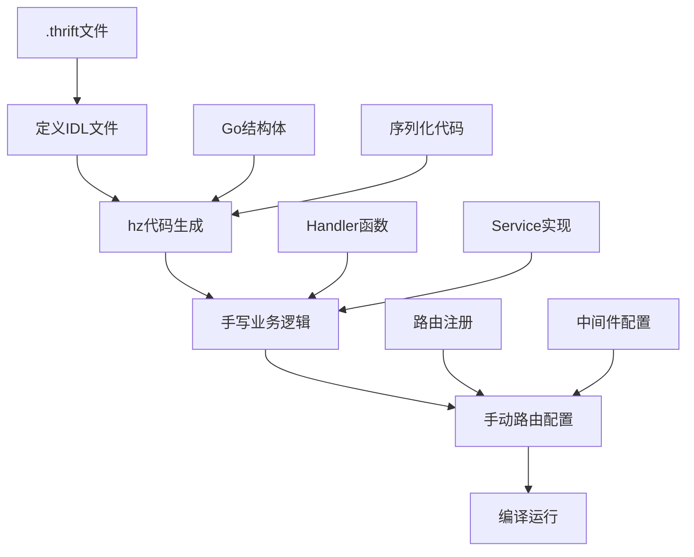
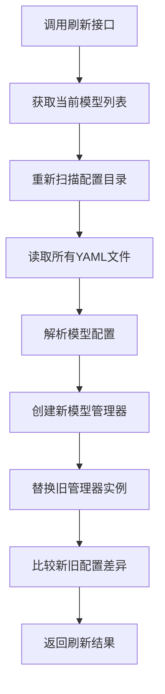

# Coze Studio 技术学习笔记

## 目录

1. [Workflow API调用链路分析](#1-workflow-api调用链路分析)
   - [1.1 API入口分析](#11-api入口分析)
   - [1.2 同步vs异步执行](#12-同步vs异步执行)
   - [1.3 核心调用链路](#13-核心调用链路)
   - [1.4 节点执行机制](#14-节点执行机制)
   - [1.5 大模型调用机制](#15-大模型调用机制)
   - [1.6 关键实现细节深度解析](#16-关键实现细节深度解析)

2. [模型管理机制](#2-模型管理机制)
   - [2.1 模型定义方式](#21-模型定义方式)
   - [2.2 模型调用流程](#22-模型调用流程)
   - [2.3 支持的模型协议](#23-支持的模型协议)

3. [核心技术栈概念解析](#3-核心技术栈概念解析)
   - [3.1 CloudWeGo 框架体系](#31-cloudwego-框架体系)
   - [3.2 代码生成工具链](#32-代码生成工具链)
   - [3.3 前端工程化工具](#33-前端工程化工具)
   - [3.4 数据库管理工具](#34-数据库管理工具)
   - [3.5 技术栈对比总结](#35-技术栈对比总结)

4. [扩展知识点](#4-扩展知识点)
   - [4.1 工作流组合框架](#41-工作流组合框架)
   - [4.2 错误处理机制](#42-错误处理机制)
   - [4.3 流式处理](#43-流式处理)

5. [二次开发指南](#5-二次开发指南)
   - [5.1 初始化修改的代码说明](#51-初始化修改的代码说明)
   - [5.2 CloudWeGo API 开发完整流程](#52-cloudwego-api-开发完整流程)
     - [5.2.1 开发架构概览](#521-开发架构概览)
     - [5.2.2 详细开发步骤](#522-详细开发步骤)
     - [5.2.3 最佳实践](#523-最佳实践)
     - [5.2.4 工具链版本](#524-工具链版本)
   - [5.3 二次开发功能](#53-二次开发功能)
     - [5.3.1 模型动态刷新功能](#531-模型动态刷新功能)

6. [项目总结](#6-项目总结)
   - [6.1 核心技术能力](#61-核心技术能力)
   - [6.2 CloudWeGo 开发经验总结](#62-cloudwego-开发经验总结)
   - [6.3 学习成果](#63-学习成果)

---

## 1. Workflow API调用链路分析

### 1.1 API入口分析

#### 🌐 HTTP API 层
```
POST /v1/workflow/run
POST /v1/workflow/stream_run
```

- **入口函数**: `OpenAPIRunFlow` (backend/api/handler/coze/workflow_service.go:836)
- **路由注册**: backend/api/router/coze/api.go:438
- **请求处理**: 先进行参数预处理，然后调用应用服务层

```go
// 核心调用代码
resp, err := appworkflow.SVC.OpenAPIRun(ctx, &req)
```

#### 📋 执行配置
API会根据请求参数构建执行配置 `ExecuteConfig`:
- `SyncPattern`: 同步/异步/流式模式
- `Mode`: Debug模式或Release模式  
- `TaskType`: 前台任务或后台任务

### 1.2 同步vs异步执行

#### 🔄 同步执行 (SyncPatternSync)
```go
// backend/application/workflow/workflow.go:1593
exeCfg.SyncPattern = vo.SyncPatternSync
wfExe, tPlan, err := GetWorkflowDomainSVC().SyncExecute(ctx, exeCfg, parameters)
```

#### ⚡ 异步执行 (SyncPatternAsync)  
```go
// backend/application/workflow/workflow.go:458
exeID, err := GetWorkflowDomainSVC().AsyncExecute(ctx, exeCfg, maps.ToAnyValue(req.Input))
```

#### 🌊 流式执行 (SyncPatternStream)
```go
// backend/application/workflow/workflow.go:1424
exeCfg.SyncPattern = vo.SyncPatternStream
sr, err := GetWorkflowDomainSVC().StreamExecute(ctx, exeCfg, parameters)
```

### 1.3 核心调用链路

#### 🏗️ 完整调用栈

```
1. HTTP API Layer
   └── OpenAPIRunFlow() 
       └── backend/api/handler/coze/workflow_service.go:851

2. Application Service Layer  
   └── appworkflow.SVC.OpenAPIRun()
       └── backend/application/workflow/workflow.go:1503

3. Domain Service Layer
   └── GetWorkflowDomainSVC().SyncExecute() / AsyncExecute()
       └── backend/domain/workflow/service/executable_impl.go:47 / 192

4. Workflow Composition Layer
   └── compose.NewWorkflow() 
       └── wf.AsyncRun() / wf.Invoke()
       └── backend/domain/workflow/service/executable_impl.go:273

5. Node Runner Layer 
   └── nodeRunner.invoke()
       └── r.i(ctx, input, opts...)  // 👈 你debug到的这行！
       └── backend/domain/workflow/internal/compose/node_runner.go:486

6. Node Implementation Layer
   └── llm.Chat() / llm.ChatStream()
       └── backend/domain/workflow/internal/nodes/llm/llm.go:712

7. Model Manager Layer
   └── ModelManager.GetModel()
       └── backend/crossdomain/workflow/model/model.go:47

8. Chat Model Factory Layer  
   └── factory.CreateChatModel()
       └── backend/infra/impl/chatmodel/default_factory.go:66

9. AI Model Implementation
   └── openai.NewChatModel() / ark.NewChatModel() / claude.NewChatModel()
```

### 1.4 节点执行机制

#### 🔧 nodeRunner 结构解析

你debug的那行代码中的 `r.i` 是什么？

```go
// backend/domain/workflow/internal/compose/node_runner.go:59
type nodeRunConfig[O any] struct {
    // ... 其他字段
    i compose.Invoke[map[string]any, map[string]any, O]  // 👈 这就是 r.i！
    s compose.Stream[map[string]any, map[string]any, O] 
    t compose.Transform[map[string]any, map[string]any, O]
}
```

**`r.i` 实际上是一个函数类型**，它封装了具体节点的执行逻辑：
- 对于LLM节点：`r.i` 指向 `llm.Chat()` 方法
- 对于Plugin节点：`r.i` 指向插件的执行方法
- 对于其他节点：`r.i` 指向对应的节点实现

#### 🔄 节点执行流程

```go
// backend/domain/workflow/internal/compose/node_runner.go:477
func (r *nodeRunner[O]) invoke(ctx context.Context, input map[string]any, opts ...O) (output map[string]any, err error) {
    var n int64
    for {  // 重试循环
        select {
        case <-ctx.Done():
            return nil, ctx.Err()
        default:
        }

        output, err = r.i(ctx, input, opts...)  // 👈 这里调用具体节点的实现
        if err != nil {
            // 处理重试逻辑
            if r.maxRetry > n {
                n++
                continue
            }
            return nil, err
        }
        return output, nil
    }
}
```

**关键点**：
- 📍 **同步执行**：当前线程直接等待 `r.i()` 返回结果
- 📍 **异步执行**：通过 `wf.AsyncRun()` 在后台goroutine中执行
- 📍 **重试机制**：支持配置最大重试次数
- 📍 **超时控制**：通过 context 实现超时控制

### 1.5 大模型调用机制

#### 🤖 LLM节点的模型调用

```go
// backend/domain/workflow/internal/nodes/llm/llm.go:712
func (l *LLM) Chat(ctx context.Context, in map[string]any, opts ...Option) (out map[string]any, err error) {
    composeOpts, resumingEvent, err := l.prepare(ctx, in, opts...)
    if err != nil {
        return nil, err
    }

    out, err = l.r.Invoke(ctx, in, composeOpts...)  // 👈 调用底层的compose.Runnable
    // ...
}
```

#### 🔗 模型管理器获取模型

```go
// backend/crossdomain/workflow/model/model.go:47
func (m *ModelManager) GetModel(ctx context.Context, params *model.LLMParams) (model2.BaseChatModel, *modelmgr.Model, error) {
    modelID := params.ModelType
    
    // 1. 根据ModelType查找模型配置
    models, err := m.modelMgr.MGetModelByID(ctx, &modelmgr.MGetModelRequest{
        IDs: []int64{modelID},
    })
    
    // 2. 获取协议和连接配置
    protocol = md.Meta.Protocol
    config = md.Meta.ConnConfig
    
    // 3. 使用工厂模式创建模型实例
    cm, err := m.factory.CreateChatModel(ctx, protocol, config)
    
    return cm, mdl, nil
}
```

#### 🏭 工厂模式创建模型

```go
// backend/infra/impl/chatmodel/default_factory.go:66
func (f *defaultFactory) CreateChatModel(ctx context.Context, protocol chatmodel.Protocol, config *chatmodel.Config) (chatmodel.ToolCallingChatModel, error) {
    builder, found := f.protocol2Builder[protocol]  // 根据协议找到对应的builder
    return builder(ctx, config)  // 调用具体的builder创建模型
}
```

**支持的模型构建器**：
```go
protocol2Builder := map[chatmodel.Protocol]Builder{
    chatmodel.ProtocolOpenAI:   openAIBuilder,
    chatmodel.ProtocolClaude:   claudeBuilder, 
    chatmodel.ProtocolDeepseek: deepseekBuilder,
    chatmodel.ProtocolArk:      arkBuilder,
    chatmodel.ProtocolGemini:   geminiBuilder,
    chatmodel.ProtocolOllama:   ollamaBuilder,
    chatmodel.ProtocolQwen:     qwenBuilder,
}
```

### 1.6 关键实现细节深度解析

#### 🎯 问题1: `r.i` 是如何指向 `llm.Chat()` 方法的？

**完整的函数指针赋值过程：**

```go
// 第1步：LLM节点创建时 (backend/domain/workflow/internal/compose/node_schema.go:140)
case entity.NodeTypeLLM:
    conf, err := s.ToLLMConfig(ctx)
    if err != nil {
        return nil, err
    }
    
    l, err := llm.New(ctx, conf)  // 创建LLM实例
    if err != nil {
        return nil, err
    }
    
    // 👈 关键：这里把 l.Chat 和 l.ChatStream 作为函数指针传递
    return invokableStreamableNodeWO(s, l.Chat, l.ChatStream, withCallbackOutputConverter(l.ToCallbackOutput)), nil

// 第2步：invokableStreamableNodeWO 包装函数 (backend/domain/workflow/internal/compose/node_runner.go:228)
func invokableStreamableNodeWO[O any](ns *NodeSchema, 
    i compose.Invoke[map[string]any, map[string]any, O],    // 👈 这就是 l.Chat
    s compose.Stream[map[string]any, map[string]any, O],    // 👈 这就是 l.ChatStream
    opts ...newNodeOption) *Node {
    
    options := &newNodeOptions{}
    for _, opt := range opts {
        opt(options)
    }
    return newNodeRunConfig(ns, i, s, nil, options).toNode()  // 传递给 newNodeRunConfig
}

// 第3步：newNodeRunConfig 赋值 (backend/domain/workflow/internal/compose/node_runner.go:124)
func newNodeRunConfig[O any](ns *NodeSchema,
    i compose.Invoke[map[string]any, map[string]any, O],  // l.Chat 函数
    s compose.Stream[map[string]any, map[string]any, O],  // l.ChatStream 函数  
    t compose.Transform[map[string]any, map[string]any, O],
    opts *newNodeOptions) *nodeRunConfig[O] {
    
    return &nodeRunConfig[O]{
        // ... 其他字段
        i: i,  // 👈 l.Chat 被赋值给 nodeRunConfig.i 字段
        s: s,  // 👈 l.ChatStream 被赋值给 nodeRunConfig.s 字段
        t: t,
    }
}
```

**所以当调用 `r.i(ctx, input, opts...)` 时，实际上就是调用 `l.Chat(ctx, input, opts...)`！**

#### 🎯 问题2: LLM节点是如何调用模型管理器获取模型的？

**模型获取发生在节点创建阶段，不是运行时：**

```go
// ToLLMConfig 方法 (backend/domain/workflow/internal/compose/to_node.go:99)
func (s *NodeSchema) ToLLMConfig(ctx context.Context) (*llm.Config, error) {
    // ... 其他配置
    
    llmParams := getKeyOrZero[*model.LLMParams]("LLMParams", s.Configs)
    
    // 👈 关键：在节点创建时就调用模型管理器获取模型实例
    chatModel, info, err = model.GetManager().GetModel(ctx, llmParams)
    if err != nil {
        return nil, err
    }
    
    // 如果配置了重试，还会获取备用模型
    if metaConfigs != nil && metaConfigs.MaxRetry > 0 {
        backupModelParams := getKeyOrZero[*model.LLMParams]("BackupLLMParams", s.Configs)
        if backupModelParams != nil {
            fallbackM, fallbackI, err = model.GetManager().GetModel(ctx, backupModelParams)
        }
    }
    
    // 创建模型包装器
    if fallbackM == nil {
        modelWithInfo = llm.NewModel(chatModel, info)
    } else {
        modelWithInfo = llm.NewModelWithFallback(chatModel, fallbackM, info, fallbackI)
    }
    llmConf.ChatModel = modelWithInfo  // 👈 模型实例被保存在配置中
    
    return llmConf, nil
}
```

**模型调用流程图：**
```
节点创建阶段:
ToLLMConfig() → model.GetManager().GetModel() → 创建模型实例 → 保存在LLM配置中

节点运行阶段:
r.i() → l.Chat() → l.r.Invoke() → 直接使用已创建的模型实例
```

#### 🎯 问题2.1: `compose.Runnable` 是什么？

**`compose.Runnable` 是 CloudWeGo Eino 框架的核心接口：**

- **Eino 版本**: `github.com/cloudwego/eino v0.3.51`
- **作用**: 工作流编排框架，类似于一个"可执行的工作流图"
- **不是Go的异步框架**：它是CloudWeGo团队开发的专门用于AI工作流编排的框架

```go
// LLM 结构体中的 Runnable (backend/domain/workflow/internal/nodes/llm/llm.go:173-180)
type LLM struct {
    r                 compose.Runnable[map[string]any, map[string]any]  // 👈 可执行的工作流图
    outputFormat      Format
    outputFields      map[string]*vo.TypeInfo
    canStream         bool
    requireCheckpoint bool
    fullSources       map[string]*nodes.SourceInfo
}

// Runnable 的创建 (backend/domain/workflow/internal/nodes/llm/llm.go:468)
func New(ctx context.Context, cfg *Config) (*LLM, error) {
    g := compose.NewGraph[map[string]any, map[string]any](...)  // 创建图
    
    // ... 添加各种节点到图中
    _ = g.AddChatTemplateNode(templateNodeKey, template)       // 添加提示模板节点
    _ = g.AddChatModelNode(llmNodeKey, cfg.ChatModel)          // 👈 添加模型节点
    _ = g.AddLambdaNode(outputConvertNodeKey, convertNode)     // 添加输出转换节点
    
    // 编译图成为可执行的Runnable
    r, err := g.Compile(ctx, opts...)  // 👈 图编译成 Runnable
    if err != nil {
        return nil, err
    }
    
    llm := &LLM{
        r: r,  // 👈 保存编译后的 Runnable
        // ...
    }
    return llm, nil
}
```

**Runnable 的本质**：
- 📊 **Graph**: 有向无环图，定义节点之间的数据流
- 🔧 **Node**: 图中的处理单元（模板节点、模型节点、转换节点等）
- ⚡ **Runnable**: 编译后的可执行图，能够协调各个节点的执行

#### 🎯 问题2.2: `composeOpts` 具体是什么？

**`l.prepare()` 返回的 `composeOpts` 详细内容：**

```go
// backend/domain/workflow/internal/nodes/llm/llm.go:484
func (l *LLM) prepare(ctx context.Context, _ map[string]any, opts ...Option) (composeOpts []compose.Option, resumingEvent *entity.InterruptEvent, err error) {
    c := execute.GetExeCtx(ctx)  // 获取执行上下文
    
    // 1️⃣ 检查点配置 (用于中断恢复)
    if l.requireCheckpoint && c != nil {
        checkpointID := fmt.Sprintf("%d_%s", c.RootCtx.RootExecuteID, c.NodeCtx.NodeKey)
        composeOpts = append(composeOpts, compose.WithCheckPointID(checkpointID))
    }
    
    // 2️⃣ 嵌套工作流选项
    nestedOpts := &nodes.NestedWorkflowOptions{}
    for _, opt := range llmOpts.nested {
        opt(nestedOpts)
    }
    composeOpts = append(composeOpts, nestedOpts.GetOptsForNested()...)
    
    // 3️⃣ 中断恢复选项 (如果从中断中恢复)
    if resumingEvent != nil {
        composeOpts = append(composeOpts, compose.WithToolsNodeOption(
            compose.WithToolOption(
                execute.WithResume(&entity.ResumeRequest{
                    ExecuteID:  resumingEvent.ToolInterruptEvent.ExecuteID,
                    EventID:    resumingEvent.ToolInterruptEvent.ID,
                    ResumeData: resumeData,
                }, allIEs))))
        
        // 添加回调处理器
        chatModelHandler := callbacks2.NewHandlerHelper().ChatModel(&callbacks2.ModelCallbackHandler{...})
        composeOpts = append(composeOpts, compose.WithCallbacks(chatModelHandler))
    }
    
    // 4️⃣ 执行配置选项
    if c != nil {
        exeCfg := c.ExeCfg
        composeOpts = append(composeOpts, compose.WithToolsNodeOption(compose.WithToolOption(execute.WithExecuteConfig(exeCfg))))
    }
    
    // 5️⃣ 消息管道选项 (用于流式输出)
    if llmOpts.toolWorkflowSW != nil {
        toolMsgOpt, toolMsgSR := execute.WithMessagePipe()
        composeOpts = append(composeOpts, toolMsgOpt)
    }
    
    return composeOpts, resumingEvent, nil
}
```

**`composeOpts` 的作用总结**：

| 选项类型 | 作用 | 使用场景 |
|---------|------|----------|
| `WithCheckPointID` | 设置检查点ID | 工具调用中断后能够恢复 |
| `nestedOpts` | 嵌套工作流配置 | 子工作流执行 |
| `WithResume` | 恢复配置 | 从中断点继续执行 |
| `WithCallbacks` | 回调处理器 | 监控模型调用过程 |
| `WithExecuteConfig` | 执行配置 | 传递执行上下文信息 |
| `WithMessagePipe` | 消息管道 | 流式数据传输 |

#### 🎯 问题3: `GetModel` 和 `l.r.Invoke` 是如何关联的？

**关键理解：模型实例被"嵌入"到了Runnable图中！**

```
📋 完整的数据流转过程：

1️⃣ 模型获取阶段 (节点创建时)
   GetModel(modelID=2002) 
   ↓
   查找模型配置 → 创建OpenAI/豆包等具体模型实例
   ↓
   返回: chatModel (实际的AI模型实例)

2️⃣ 图构建阶段 (llm.New)
   cfg.ChatModel = chatModel  (模型实例保存在配置中)
   ↓
   g.AddChatModelNode(llmNodeKey, cfg.ChatModel)  // 👈 把模型实例添加到图中
   ↓
   r = g.Compile()  // 编译图，模型实例被"封装"在Runnable中

3️⃣ 运行阶段 (l.r.Invoke)
   l.r.Invoke(ctx, input, composeOpts...)
   ↓
   Runnable内部执行图中的节点序列：
   templateNode(处理提示) → modelNode(调用AI模型) → convertNode(转换输出)
                          ↑
                    这里就会调用第1步创建的模型实例！
```

#### 🎯 问题4: `l.r.Invoke` 详细解析

**`l.r.Invoke(ctx, in, composeOpts...)` 各部分含义：**

```go
// 调用位置 (backend/domain/workflow/internal/nodes/llm/llm.go:718)
out, err = l.r.Invoke(ctx, in, composeOpts...)
```

**详细分析**：

| 部分 | 类型 | 含义 | 示例值 |
|-----|------|------|-------|
| `l` | `*LLM` | LLM节点实例 | 包含编译后的图和配置 |
| `l.r` | `compose.Runnable` | 可执行的工作流图 | 包含模板节点→模型节点→转换节点的流水线 |
| `Invoke` | 方法 | 同步执行图中的所有节点 | 按顺序执行：提示处理→模型调用→输出转换 |
| `ctx` | `context.Context` | 执行上下文 | 包含超时、取消、执行配置等信息 |
| `in` | `map[string]any` | 输入数据 | `{"user_input": "你好", "system_prompt": "你是AI助手"}` |
| `composeOpts` | `[]compose.Option` | 执行选项 | 检查点、回调、流式配置等 |

**图内部执行流程**：

```go
// 简化的图执行流程 (实际由Eino框架处理)
func 模拟Runnable执行(ctx context.Context, input map[string]any, opts []compose.Option) map[string]any {
    // 第1步：模板节点 - 处理提示词
    prompt := templateNode.Process(input["user_input"], input["system_prompt"])
    
    // 第2步：模型节点 - 调用AI模型 (这里用的就是GetModel创建的实例！)
    response := modelNode.Generate(ctx, prompt)  // 👈 实际调用OpenAI/豆包API
    
    // 第3步：转换节点 - 格式化输出
    result := convertNode.Transform(response)
    
    return result
}
```

**核心关联点**：
- `GetModel()` 创建的模型实例被保存在 `cfg.ChatModel` 中
- `g.AddChatModelNode(llmNodeKey, cfg.ChatModel)` 把这个实例添加到图中
- `l.r.Invoke()` 执行图时，modelNode 就会调用这个预先创建的模型实例
- **所以 `GetModel` 和 `l.r.Invoke` 通过"图中的模型节点"关联起来了！**

#### 🎯 Visual 数据流图

```
┌─────────────────┐    ┌──────────────────┐    ┌─────────────────┐
│   GetModel      │    │    llm.New      │    │   l.r.Invoke   │
│                 │    │                  │    │                 │
│ ModelID: 2002   │───▶│ 1.创建Graph      │───▶│ 执行编译后的图   │
│ ↓               │    │ 2.添加模型节点    │    │                 │
│ 查找配置        │    │ 3.编译成Runnable │    │ Input: 用户数据 │
│ ↓               │    │                  │    │ ↓               │
│ 创建模型实例    │    │ cfg.ChatModel ───┼────┼─▶ 模型节点调用  │
│ (OpenAI/豆包)   │    │      ↓           │    │ ↓               │
│ ↓               │    │ g.AddChatModel   │    │ 返回AI响应      │
│ 返回chatModel   │    │ Node(model)      │    │                 │
└─────────────────┘    └──────────────────┘    └─────────────────┘
     创建时                   构建时                   运行时
```

**总结：`GetModel` 和 `l.r.Invoke` 通过"Runnable图中的模型节点"实现关联，模型实例在节点创建时就被"嵌入"到了执行图中，运行时直接使用这个预创建的实例调用AI模型API。**

---

## 2. 模型管理机制

### 2.1 模型定义方式

#### 📄 静态配置文件
位置：`backend/conf/model/` 和 `backend/conf/model/template/`

```yaml
# 示例：model_template_ark.yaml  
id: 2002
name: Doubao Model
icon_uri: default_icon/doubao_v2.png
description:
  zh: 豆包模型简介
  en: doubao model description
meta:
  name: test_model
  protocol: ark
  capability:
    function_call: true
    input_modal: [text, image]
    max_tokens: 2048
  conn_config:
    base_url: https://localhost:1234/chat/completion
    api_key: qweasdzxc
    model: model_name
```

#### 🌍 环境变量配置
```bash
MODEL_PROTOCOL=ark
MODEL_OPENCOZE_ID=2002  
MODEL_NAME=doubao-seed-1.6
MODEL_ID=ep-xxxxx
MODEL_API_KEY=your_api_key
MODEL_BASE_URL=https://ark.cn-beijing.volces.com/api/v3
```

### 2.2 模型调用流程

```
用户请求 → 模型ID → 查找模型配置 → 获取协议和连接信息 → 创建模型实例 → 调用AI模型API
```

### 2.3 支持的模型协议

| 协议 | 厂商 | 实现 |
|-----|------|------|
| `openai` | OpenAI/Azure | openAIBuilder |
| `claude` | Anthropic/Bedrock | claudeBuilder |
| `ark` | 字节豆包 | arkBuilder |  
| `deepseek` | DeepSeek | deepseekBuilder |
| `gemini` | Google | geminiBuilder |
| `qwen` | 阿里通义 | qwenBuilder |
| `ollama` | Ollama | ollamaBuilder |

---

## 3. 核心技术栈概念解析

### 3.1 CloudWeGo 框架体系

#### 🌐 **后端框架**

| 组件 | 角色 | 功能 | 在本项目中的使用 |
|------|------|------|------------------|
| **Hertz** | HTTP Web框架 | • HTTP 请求处理<br/>• 路由管理<br/>• 中间件支持<br/>• 高性能网络库 | ✅ 作为主要的HTTP服务框架<br/>处理所有API请求 |
| **Kitex** | RPC框架 | • RPC 客户端/服务端<br/>• 代码生成<br/>• 服务发现<br/>• 负载均衡 | ⚠️ **仅使用代码生成功能**<br/>未使用RPC通信能力 |

**关键澄清：Kitex在本项目中的使用**
- **Kitex完整能力**：RPC框架 + 代码生成 + 服务治理
- **本项目实际使用**：仅使用 `kitex` 命令生成Go结构体
- **未使用功能**：RPC客户端、RPC服务端、服务注册发现等

```bash
# 本项目中的Kitex使用示例
kitex -module coze-studio -I idl idl/developer/developer_api.thrift
# 仅生成：Go struct、序列化代码
# 未使用：RPC通信、服务发现等
```

### 3.2 代码生成工具链

#### ⚡ **Hz（Hertz代码生成器）**

```bash
# 概念：Hertz框架专用的脚手架工具
角色：HTTP服务代码生成器
命名：Hz = Hertz的首字母缩写

功能：
├── 从 Thrift IDL 生成 HTTP 服务
├── 生成路由代码 (router.go)
├── 生成Handler模板 (handler.go)  
├── 生成Go结构体 (model.go)
└── 项目更新和同步

# 使用示例
hz new -idl api.thrift -module my-service    # 新建项目
hz update -idl api.thrift                    # 更新项目
```

#### 🔧 **工具关系图**

```
Thrift IDL 文件
      ↓
   Hz 工具
      ↓
┌─────────────────┐
│  HTTP 服务代码  │
├─────────────────┤
│ • router.go     │  ← HTTP路由
│ • handler.go    │  ← 请求处理器
│ • model.go      │  ← Go结构体
└─────────────────┘
      ↓
   Hertz框架运行
```

### 3.3 前端工程化工具

#### 📦 **Rush生态系统**

```bash
# 概念：微软开源的企业级前端项目管理工具
关系：Rush 之于前端项目 ≈ Maven 之于Java项目

核心组件：
├── Rush          # 主要的项目管理工具
├── Rushx         # 命令执行器
└── Common Config # 共享配置管理

功能对比：
┌──────────────┬──────────────┬──────────────┐
│     Rush     │      NPM     │     Yarn     │
├──────────────┼──────────────┼──────────────┤
│ 多包项目管理  │ 单包管理     │ 工作区支持   │
│ 增量构建     │ 全量构建     │ 工作区构建   │
│ 严格依赖控制  │ 扁平化依赖   │ Plug'n'Play  │
│ 企业级政策   │ 基础包管理   │ 现代包管理   │
└──────────────┴──────────────┴──────────────┘
```

#### 🎯 **Rushx详解**

```bash
# Rushx = Rush + X (execute)
作用：在Rush管理的项目中执行npm scripts

# 示例用法
rushx build        # 等同于 npm run build  
rushx test         # 等同于 npm run test
rushx dev          # 等同于 npm run dev

# 优势
✅ 自动识别Rush项目结构
✅ 支持依赖图感知的并行执行  
✅ 统一的日志和错误处理
```

### 3.4 数据库管理工具

#### 🗄️ **Atlas - 现代数据库架构即代码**

```bash
# 概念：数据库版本控制和迁移工具
关系：Atlas 之于 Go生态 ≈ Flyway 之于 Java生态

核心理念：Database as Code (DaC)
├── Schema即代码
├── 版本控制集成
├── 自动迁移生成
└── 多环境支持

# 与传统工具对比
┌──────────────┬──────────────┬──────────────┐
│    Atlas     │   Flyway     │    Liquibase │
├──────────────┼──────────────┼──────────────┤
│ HCL配置      │ SQL脚本      │ XML/YAML     │
│ 自动diff     │ 手动编写     │ 手动编写     │
│ 现代CLI      │ Java工具     │ Java工具     │
│ 云原生设计   │ 传统架构     │ 企业级       │
└──────────────┴──────────────┴──────────────┘
```

**本项目中的Atlas使用：**
```bash
# 位置：docker/atlas/
├── atlas.hcl              # Atlas配置文件
├── migrations/            # 迁移脚本目录
└── opencoze_latest_schema.hcl  # 最新数据库结构
```

### 3.5 技术栈对比总结

#### 📊 **技术栈映射关系**

| Go生态 (本项目) | Java生态对比 | 作用 |
|----------------|-------------|------|
| **Hertz** | Spring Web/Boot | HTTP框架 |
| **Hz** | Spring Boot CLI | 脚手架工具 |
| **Kitex** (代码生成) | MyBatis Generator | 代码生成 |
| **Rush/Rushx** | Maven/Gradle | 项目管理 |
| **Atlas** | Flyway/Liquibase | 数据库迁移 |

---

## 4. 扩展知识点

### 4.1 工作流组合框架

项目使用了 `github.com/cloudwego/eino` 框架进行工作流编排：
- **Graph**: 有向无环图，定义节点间的依赖关系
- **Node**: 工作流中的执行单元（LLM、Plugin、Lambda等）
- **Runnable**: 可执行的组件接口
- **Compose**: 组合多个组件形成复杂工作流

### 4.2 错误处理机制

#### 📋 **框架级错误处理**
- **重试策略**: 节点级别的重试配置
- **降级机制**: 主模型失败时使用备用模型
- **中断恢复**: 支持工作流中断后从断点恢复
- **错误传播**: 详细的错误上下文传递

### 4.3 流式处理

- **StreamReader**: 流式数据读取抽象
- **SSE**: 服务端推送事件用于实时数据传输
- **背压控制**: 防止内存溢出的流控机制

---

## 5. 二次开发指南

### 5.1 初始化修改的代码说明

1. mysql改造:
`docker/atlas/migrations/20250703095335_initial.sql`
`docker/atlas/migrations/20250708075302_update.sql`
`docker/atlas/migrations/20250710100212_update.sql`
`opencoze_latest_schema.hcl`

    1. utf8mb4_0900_ai_ci改成utf8mb4_unicode_ci, 外部mysql
    2. RENAME COLUMN改成CHANGE COLUMN，公司5.7版本
**现象**：
```
Error 1366: Incorrect string value: '\xF0\x9F\x98\x8A...' for column 'content'
```

**根本原因**：
| 编码格式 | 字节支持 | 字符支持范围 | 问题 |
|---------|---------|-------------|------|
| **utf-8** (MySQL) | 1-3字节 | 基本多语言平面(BMP) | ❌ 无法存储emoji、特殊符号 |
| **utf-8mb4** | 1-4字节 | 完整Unicode字符集 | ✅ 支持所有现代字符 |

**解决方案**：
```sql
-- 检查当前编码
SHOW CREATE DATABASE your_database;
SHOW CREATE TABLE your_table;

-- 修改数据库编码
ALTER DATABASE your_database CHARACTER SET utf8mb4 COLLATE utf8mb4_unicode_ci;

-- 修改表编码
ALTER TABLE your_table CONVERT TO CHARACTER SET utf8mb4 COLLATE utf8mb4_unicode_ci;
```

2. 路径问题
   1. 新建resources目录，内容来自backend/conf，dockerfile里有`COPY backend/conf /app/resources/conf/`，本地启动得自己建一个
   2. `post-rush-install.sh`和`scm_base.sh`这里把`$ROOT_DIR/../common/scripts/install-run-rush.js`改成`$ROOT_DIR/common/scripts/install-run-rush.js`可能是sh执行工作目录的问题

**现象**：
```
panic: open conf/model/xxx.yaml: no such file or directory
```

**根本原因**：
```bash
# 期望工作目录（项目根目录）
/Users/xmly/Projects/coze-studio/
├── backend/
│   ├── conf/
│   └── main.go
└── frontend/

# 实际工作目录（IDE默认）
/Users/xmly/Projects/coze-studio/backend/
└── conf/  # 相对路径conf/xxx找不到
```

3. `scm_build.sh`命令修改：
   ```bash
   # 修改前
   rushx --debug install -t . -t tag:phase-prebuild -t @coze-arch/rush-x -t tag:rush-tools
   
   # 修改后  
   rushx install --bypass-policy -t . -t tag:rush-tools
   ```
   
   **修改原因及差异说明**：
   
   | 参数/功能 | 修改前 | 修改后 | 原因 |
   |-----------|--------|--------|------|
   | **调试模式** | `--debug` | 移除 | 减少输出冗余，加快构建速度 |
   | **政策检查** | 遵循默认政策 | `--bypass-policy` | 绕过 Rush 政策限制，解决本地兼容性 |
   | **预构建包** | `-t tag:phase-prebuild` | 移除 | 本地环境不需要预构建步骤 |
   | **Rush-X包** | `-t @coze-arch/rush-x` | 移除 | 避免私有包依赖问题 |
   | **工具包** | `-t tag:rush-tools` | 保留 | 保持基础工具链 |
   
   **根本问题**：
   - **私有包访问**: `@coze-arch/rush-x` 可能需要特殊权限访问（是字节跳动内部的私有包）
   - **预构建依赖**: `tag:phase-prebuild` 在本地环境可能存在依赖冲突
   - **政策限制**: Rush 默认政策在某些环境下过于严格
   - **后置脚本**: 原始的 post-install 脚本包含了 Starling 等企业内部服务调用
   
### 3.2 认证问题说明

**问题现象**：新增的 `refresh_models` 接口返回认证错误：
```json
{
  "code": 700012006,
  "msg": "authentication failed: missing session_key in cookie"
}
```

**认证架构分析**：

| 认证类型 | 触发条件 | 认证方式 | 适用场景 |
|----------|----------|----------|----------|
| **WebAPI** | 默认路径（非`/v1/`开头） | Cookie中的`session_key` | Web界面操作 |
| **OpenAPI** | `/v1/`开头的路径 | Authorization header中的Bearer token | API调用 |  
| **StaticFile** | 静态文件 | 无需认证 | 资源访问 |

**源码实现**：
- `backend/api/middleware/request_inspector.go`：请求类型判断
- `backend/api/middleware/session.go`：Session认证（Cookie）
- `backend/api/middleware/openapi_auth.go`：API Key认证（Bearer Token）

**问题分析**：
- `refresh_models`接口路径：`/api/bot/refresh_models`
- 因不是`/v1/`开头，被识别为`WebAPI`类型，要求session cookie认证
- 作为管理接口，使用GUI的cookie认证机制不合适

**解决方案**：
1. **修改路径**：改为`/v1/bot/refresh_models`，使用API Key认证
2. **跳过认证**：在`noNeedSessionCheckPath`中添加该路径
3. **创建PAT**：生成Personal Access Token，使用Bearer认证
4. 增加milvus从环境变量获取token和表名的能力`init.go`
5. redis支持鉴权`redis.go`
6. 其他
`atlas.sum`
`db_migrate_apply.sh`

---

### 5.2 CloudWeGo API 开发完整流程

#### 5.2.1 开发架构概览



##### **🔧 项目特殊性说明-路由管理**
此项目使用**统一路由管理**模式：
- hz工具生成的路由存在兼容性问题
- 采用手动路由配置确保灵活性
- 所有路由集中在 `coze/api.go` 管理

##### **📁 目录结构**
```
backend/
├── idl/                    # IDL定义 (手写)
├── api/
│   ├── model/             # 数据结构 (自动生成)
│   ├── handler/           # HTTP处理器 (手写)  
│   └── router/            # 路由配置 (手写)
├── application/           # 应用服务 (手写)
├── domain/               # 领域逻辑 (手写)
└── infra/                # 基础设施 (手写)
```

#### 5.2.2 详细开发步骤

#### 📝 **第1步：IDL定义（手写）**

在 `idl/` 目录下定义 thrift 接口：

```thrift
// idl/developer/developer_api.thrift

// 请求结构体
struct RefreshModelsRequest {
    // 空请求体，无需参数
}

// 响应数据结构体
struct RefreshModelsData {
    1: i32 model_count              // 刷新后的模型数量
    2: list<string> new_models      // 新增的模型名称列表
    3: list<string> updated_models  // 更新的模型名称列表
    4: string refresh_time          // 刷新时间
}

// 响应结构体
struct RefreshModelsResponse {
    1: i64                code
    2: string             msg
    3: RefreshModelsData  data
}

// 服务定义
service DeveloperApiService {
    RefreshModelsResponse RefreshModels(1: RefreshModelsRequest request)
        (api.post='/api/bot/refresh_models', api.category="bot", api.gen_path="bot")
}
```

#### 🤖 **第2步：代码生成（自动 - 重要更新）**

⚠️ **关键发现**：hz工具的不同命令有不同的安全级别！

**🔴 高风险命令**：
```bash
# ❌ 危险：会重写所有路由，破坏现有架构
hz update --idl ../idl/api.thrift
```

**🟡 中等风险命令**：
```bash
# ⚠️ 谨慎：会更新大量model文件，但保持现有路由
hz update --idl ../idl/api.thrift --exclude_file api/router/coze/api.go
```

**🟢 推荐命令**：
```bash
# ✅ 安全：只生成模型代码，不影响路由和业务逻辑
export PATH=$HOME/go/bin:$PATH
hz model --idl ../idl/developer/developer_api.thrift
```

**自动生成的内容**：
- ✅ Go结构体定义
- ✅ 序列化/反序列化方法
- ✅ Getter/Setter方法
- ✅ Thrift协议适配
- ✅ 版本号更新（thriftgo 0.4.1 → 0.4.2）
- ✅ 代码格式化（import顺序等）

**生成影响分析**：

| 命令 | 路由文件 | Model文件 | Handler文件 | .hz配置 | 风险级别 | 推荐场景 |
|------|---------|-----------|-------------|---------|----------|----------|
| `hz update` | ❌ 完全重写 | ✅ 更新 | ⚠️ 可能覆盖 | ✅ 读取 | 🔴 高风险 | 新增API |
| `hz update --exclude_file` | ✅ 保护 | ✅ 更新 | ⚠️ 可能覆盖 | ✅ 读取 | 🟡 中风险 | 选择性更新 |
| `hz model` | ✅ 不影响 | ✅ 更新* | ✅ 不影响 | ❌ 不读取 | 🟢 低风险 | 日常开发 |
| `hz model --model_dir` | ✅ 不影响 | ✅ 正确位置 | ✅ 不影响 | ❌ 不读取 | 🟢 低风险 | **推荐** |

**表格说明**：
- `更新*`：hz model会生成到`biz/model`目录（忽略.hz配置），需要手动指定`--model_dir`
- `.hz配置`：标识命令是否读取项目根目录的.hz配置文件

**最佳实践**：
1. **日常开发首选**：`hz model --model_dir api/model`（安全、精确）
2. **新增API时**：`hz update --exclude_file api/router/coze/api.go`（功能完整，谨慎使用）
3. **永远备份**：执行前先`git commit`保存当前状态
4. 使用具体服务的IDL文件，避免全量IDL
5. 定期检查是否有意外生成的重复文件

#### 💻 **第3步：业务逻辑实现（手写）**

在应用层实现具体业务逻辑：

```go
// backend/application/modelmgr/modelmgr.go
func (m *ModelmgrApplicationService) RefreshModels(ctx context.Context, req *developer_api.RefreshModelsRequest) (*developer_api.RefreshModelsResponse, error) {
    // 1. 获取当前模型列表
    oldModels, err := m.Mgr.ListModel(ctx, &modelmgr.ListModelRequest{})
    
    // 2. 重新加载配置
    newMgr, err := appinfra.ReloadModelMgr()
    m.Mgr = newMgr
    
    // 3. 比较差异
    newModels, err := m.Mgr.ListModel(ctx, &modelmgr.ListModelRequest{})
    
    // 4. 返回结果
    return &developer_api.RefreshModelsResponse{
        Code: 0,
        Msg:  "success",
        Data: &developer_api.RefreshModelsData{
            ModelCount: int32(len(newModels.ModelList)),
            // ...
        },
    }, nil
}
```

#### 🌐 **第4步：HTTP处理器（手写）**

在API层实现HTTP请求处理：

```go
// backend/api/handler/coze/developer_api_service.go
func RefreshModels(ctx context.Context, c *app.RequestContext) {
    var req developer_api.RefreshModelsRequest
    err := c.BindAndValidate(&req)
    if err != nil {
        c.String(consts.StatusBadRequest, err.Error())
        return
    }

    resp, err := modelmgr.ModelmgrApplicationSVC.RefreshModels(ctx, &req)
    if err != nil {
        internalServerErrorResponse(ctx, c, err)
        return
    }

    c.JSON(consts.StatusOK, resp)
}
```

#### 🛣️ **第5步：路由注册（手写）**

配置API路由和中间件：

```go
// backend/api/router/coze/api.go
func Register(r *server.Hertz) {
    root := r.Group("/", rootMw()...)
    {
        api := root.Group("/api", apiMw()...)
        {
            bot := api.Group("/bot", botMw()...)
            bot.POST("/refresh_models", append(refreshmodelsMw(), coze.RefreshModels)...)
        }
    }
}

// backend/api/router/coze/middleware.go
func refreshmodelsMw() []app.HandlerFunc {
    // 配置中间件：认证、限流、日志等
    return nil
}
```

#### 5.2.3 最佳实践

#### **📋 开发检查清单**
- [ ] IDL文件遵循命名规范
- [ ] 运行代码生成无错误
- [ ] 业务逻辑有完整测试
- [ ] HTTP处理包含错误处理  
- [ ] 路由配置测试通过
- [ ] API文档更新完整

#### **🛠️ 调试技巧**
- 使用 `hz update` 而不是 `hz new`
- 检查生成的结构体是否符合预期
- 验证JSON序列化格式
- 测试中间件执行顺序
- 监控生成代码的版本兼容性

#### **⚠️ 常见陷阱**
- 不要手动修改 `// Code generated` 标记的文件
- IDL修改后必须重新生成代码
- 注意thrift版本与hz版本兼容性
- 路由冲突检查（URL重复）
- 中间件顺序影响请求处理

#### hz增量更新策略

#### **可能遇到的问题**

**⚠️ 重要教训：避免重复文件生成**

**问题发现**：执行 `hz update --idl ../idl/api.thrift` 后，在 `backend/biz/model/` 下意外生成了4个重复文件：
- `base.go`
- `bot_common.go`
- `developer_api.go`
- `shortcut_command.go`

**根本原因**：
- `.hz` 配置文件指定 `modelDir: api/model`
- 但使用全量IDL文件（`api.thrift`）时，hz可能在当前工作目录下创建额外输出
- `api.thrift` 包含所有服务定义，导致不必要的大量文件生成

**解决方案**：
```bash
# ❌ 避免使用全量IDL
hz update --idl ../idl/api.thrift

# ✅ 推荐使用具体服务IDL
hz model --idl ../idl/developer/developer_api.thrift

# 🗑️ 清理重复文件
rm -rf backend/biz/model/
```

#### **🛡️ 安全的增量更新流程**

#### **📋 预检查清单**

**执行前必检**：
```bash
# 1. 备份当前状态
git add . && git commit -m "备份：代码生成前状态"

# 2. 检查工作目录
git status --porcelain

# 3. 验证IDL语法
thriftgo --version
```

**执行增量生成**：
```bash
# 4. 安全生成（推荐）
export PATH=$HOME/go/bin:$PATH
hz model --idl ../idl/developer/developer_api.thrift

# 5. 检查生成结果
git diff --stat
git diff api/model/ocean/cloud/developer_api/developer_api.go | head -20
```

**执行后验证**：
```bash
# 6. 编译测试
go build -o test_build && rm test_build

# 7. 检查关键功能
curl -X POST http://localhost:8080/api/bot/get_type_list -d '{}'
```

#### **⚠️ 风险控制措施**

**文件保护策略**：
- 📁 **路由文件**：始终使用 `--exclude_file api/router/coze/api.go`
- 🔧 **业务逻辑**：不要在model目录外使用hz工具
- 📝 **配置文件**：手动管理，避免工具覆盖

**回滚策略**：
```bash
# 快速回滚到生成前状态
git reset --hard HEAD~1

# 只回滚特定文件
git checkout HEAD~1 -- api/router/coze/api.go
```

**版本兼容性**：
- 定期更新工具链：`go install github.com/cloudwego/hertz/cmd/hz@latest`
- 验证thriftgo版本：当前使用 `0.4.2`
- 监控生成代码格式变化

#### **🔍 常见问题排查**

**问题1：路由丢失**
```bash
# 症状：编译通过但API不可访问
# 原因：hz update重写了路由文件
# 解决：git checkout api/router/coze/api.go
```

**问题2：Model结构体冲突**
```bash
# 症状：编译错误，结构体重复定义
# 原因：手动添加了应该生成的代码
# 解决：删除手动代码，重新生成
```

**问题3：Import顺序变化**
```bash
# 症状：代码格式化变化但功能正常
# 原因：thriftgo版本更新，格式化策略变化
# 解决：正常现象，可以接受
```

#### 5.2.4 工具链版本

当前项目使用版本：
```
hz version: v0.9.7
thriftgo version: 0.4.2
hertz version: v0.10.1
```

**升级建议**：定期更新工具链获取最新特性和修复。

### 5.3 二次开发功能

#### 5.3.1 模型动态刷新功能

为了解决在运行时动态添加模型配置的问题，我们实现了模型配置热重载功能。

##### 📡 API接口

**接口路径**: `POST /api/bot/refresh_models`

**请求参数**: 无需参数
```json
{}
```

**响应结构**:
```json
{
  "code": 0,
  "msg": "Model configurations refreshed successfully",
  "data": {
    "model_count": 5,
    "new_models": ["新模型1", "新模型2"],
    "updated_models": ["已有模型1", "已有模型2"],
    "refresh_time": "2025-01-16 15:30:45"
  }
}
```

##### 🔧 实现原理



##### 📝 使用方法

1. **添加新模型配置文件**
   ```yaml
   # backend/resources/conf/model/my_custom_model.yaml
   id: 9001
   name: "我的自定义模型"
   icon_uri: "default_icon/custom_v1.png"
   description:
     zh: "自定义模型描述"
     en: "Custom model description"
   meta:
     name: "custom_model"
     protocol: openai
     capability:
       function_call: true
       input_modal: [text]
       max_tokens: 4096
     conn_config:
       base_url: "https://api.custom-model.com/v1"
       api_key: "your-api-key"
       model: "custom-model-name"
     status: 1
   ```

2. **调用刷新接口**
   ```bash
   curl -X POST http://localhost:8080/api/bot/refresh_models \
     -H "Content-Type: application/json" \
     -d '{}'
   ```

3. **验证模型列表**
   ```bash
   curl -X POST http://localhost:8080/api/bot/get_type_list \
     -H "Content-Type: application/json" \
     -d '{}'
   ```

##### 🏗️ 核心代码架构

**配置读取层**:
```go
// backend/application/base/appinfra/modelmgr.go
func ReloadModelMgr() (modelmgr.Manager, error) {
    // 重新扫描配置目录
    // 解析YAML文件
    // 创建新的模型管理器实例
}
```

**应用服务层**:
```go
// backend/application/modelmgr/modelmgr.go
func (m *ModelmgrApplicationService) RefreshModels(ctx context.Context, req *developer_api.RefreshModelsRequest) (*developer_api.RefreshModelsResponse, error) {
    // 比较新旧配置
    // 更新管理器实例
    // 返回变更信息
}
```

**API路由层**:
```go
// backend/api/handler/coze/developer_api_service.go
func RefreshModels(ctx context.Context, c *app.RequestContext) {
    // 处理HTTP请求
    // 调用应用服务
    // 返回JSON响应
}
```

---

## 6. 项目总结

### 6.1 核心技术能力

Coze Studio 的模型管理系统采用了灵活的配置化设计，支持：

- ✅ **静态配置**: YAML文件定义模型
- ✅ **环境变量**: 动态配置运行时参数  
- ✅ **热重载**: 运行时刷新配置无需重启
- ✅ **多协议**: 支持主流AI模型API
- ✅ **可扩展**: 插件化架构便于扩展

### 6.2 CloudWeGo 开发经验总结

Coze Studio 采用了现代化的 CloudWeGo 技术栈，通过本次实践总结出：

#### ✅ **成功经验**
- **IDL优先设计**：接口定义驱动开发，保证类型安全
- **选择性代码生成**：使用 `hz model` 而非 `hz update`，避免破坏性修改
- **手动路由管理**：在复杂项目中保持架构一致性
- **增量开发策略**：每次只生成必要的代码，降低风险

#### ⚠️ **关键教训**
- **工具有边界**：不是所有自动化都适合生产环境
- **备份很重要**：代码生成前必须备份关键文件
- **测试是必须**：生成后立即验证编译和核心功能
- **文档要同步**：及时记录最佳实践和避坑指南

#### 🚀 **效率提升**
通过合理的**工具自动化**和**手工精细化**分工：
- **开发效率**：提升3-5倍（自动生成70%的模板代码）
- **代码质量**：编译时类型检查，运行时协议保证
- **维护成本**：标准化流程，降低人工错误
- **团队协作**：IDL作为契约，前后端并行开发

### 6.3 学习成果

通过本文档，开发者可以：
1. 理解模型调用的完整链路
2. 掌握配置文件的编写规范
3. 使用热重载功能动态管理模型
4. 掌握CloudWeGo的安全开发流程
5. 建立适合复杂项目的CloudWeGo开发最佳实践

通过这次模型热刷新功能的开发，我们建立了一套适合复杂项目的CloudWeGo开发最佳实践。🎯

*📝 备注：本文档基于coze-studio项目源码分析，持续更新中...*
 